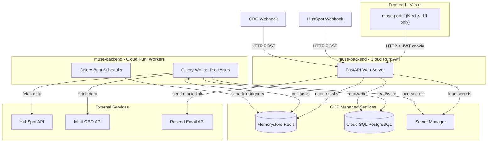
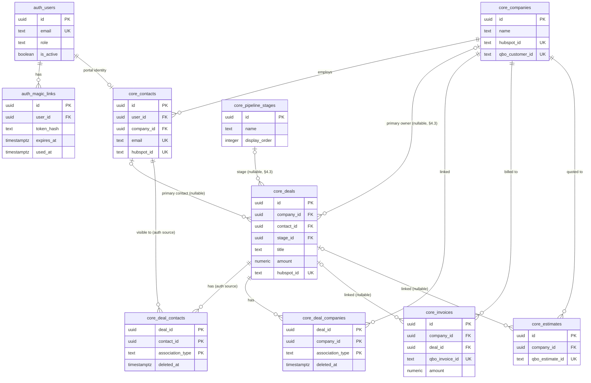
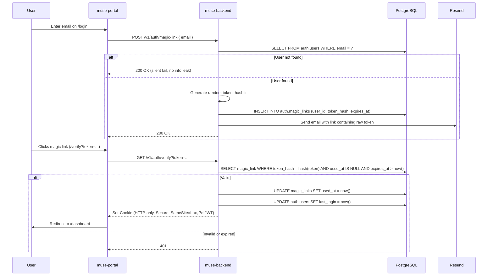

# Architecture: Muse Backend (`muse-backend`)

## 1. Executive Summary

**`muse-backend`** is the centralized Python backend for Muse Semiconductor's internal operations platform. It replaces all server-side logic currently spread across:

- The Next.js Portal's `/api` routes and backend modules (~1,300 lines of auth, HubSpot, QBO, GCP code).
- The legacy `python_applications` cron scripts (40+ scripts for HubSpot, QBO, Box, Dropbox, TSMC, etc.).

After this project is complete:

- **The Next.js Portal (`muse-portal`)** becomes a pure React frontend with zero backend logic. It calls `muse-backend` for everything.
- **The legacy Python scripts (`muse-scripts`)** are gradually migrated into `muse-backend` as Celery tasks.
- **HubSpot** is decommissioned over three phases. All CRM data (users, deals, companies) lives in PostgreSQL.
- **QuickBooks Online** remains as the permanent external accounting system. `muse-backend` owns the OAuth lifecycle and syncs accounting data into PostgreSQL.

---

## 2. Technology Stack

| Layer | Choice | Why |
|---|---|---|
| **Language** | Python 3.12+ | Existing Python codebase (`python_applications`); superior JSON/data manipulation; reuse of `hsapi_token`, `qbo_module`, `box_webhook_listener` |
| **Web Framework** | FastAPI | Async, automatic OpenAPI/Swagger, Pydantic validation, extremely fast |
| **Background Jobs** | Celery + RedBeat | Replaces GCP Cloud Scheduler + Pub/Sub; native rate limiting, retries with backoff, task chaining, cron scheduling. RedBeat keeps the schedule in Redis and provides a distributed lock so accidental multi-replica Beat can't double-fire (§10.1) |
| **Message Broker** | Redis (GCP Memorystore) | Required by Celery; also holds the RedBeat schedule; replaces the Redis + RQ pattern already used in `box_webhook_listener` |
| **ORM** | SQLAlchemy 2.0 | Dual engines: async (`asyncpg`) for FastAPI, sync (`psycopg2`) for Celery -- same database, different drivers. Multi-schema PostgreSQL support; migration via Alembic |
| **Migrations** | Alembic | Versioned, repeatable schema changes across environments. `include_schemas=True` to cover `auth`/`core`/`raw_sync`/`qbo` |
| **Data Validation** | Pydantic v2 | Strict typing for webhook payloads, API requests/responses, config. `from_attributes=True` on all response models; no `alias_generator` -- wire format is snake_case (§15.3) |
| **Database** | PostgreSQL 15+ on Cloud SQL | Four schemas: `auth`, `core`, `raw_sync`, `qbo` |
| **Object Storage** | GCS bucket `muse-qbo-pdfs` | Cached QBO invoice/estimate PDFs (§5.6) |
| **Secrets** | GCP Secret Manager (env fallback) | Same resolution pattern as the current Portal (`env -> cache -> Secret Manager`) |
| **Email** | Resend (`resend` Python SDK) | Magic link emails (ported from Portal's `modules/email/`) |
| **Logging** | `structlog` + GCP Cloud Logging | Structured JSON logs, auto-ingested on Cloud Run |
| **Error Tracking** | Sentry (`sentry-sdk[fastapi,celery,sqlalchemy]`) | Unhandled exceptions, slow-query breadcrumbs, release tagging for regression attribution (§13.2) |
| **API Contract** | OpenAPI 3.1 (FastAPI-generated) + Schemathesis + `openapi-typescript-codegen` | The portal imports a generated TypeScript SDK so backend field renames are caught at `tsc` time (§14.2, §15) |
| **Containerization** | Docker | Single image, three Cloud Run services (API server, Celery worker, RedBeat scheduler as singleton) |

---

## 3. System Architecture

### 3.1 Component Overview



### 3.2 Data Flow

There are four distinct data flows in the system:

**Flow 1: Portal Request (synchronous)**
Portal sends HTTP request -> FastAPI authenticates JWT -> reads/writes `core` schema -> returns JSON.

**Flow 2: Webhook Ingestion (async, via Celery)**
External source sends webhook -> FastAPI validates HMAC signature -> responds `200` immediately -> queues a Celery task -> Celery worker parses payload -> upserts into `raw_sync` tables -> triggers mapping into `core` tables.

**Flow 3: Hourly Sync (scheduled, via Celery Beat)**
Celery Beat fires on cron schedule -> Celery worker fetches changes from HubSpot/QBO APIs -> upserts into `raw_sync` tables -> triggers mapping into `core` tables.

**Flow 4: Legacy Script Migration (gradual)**
Existing `python_applications` cron scripts -> refactored into Celery tasks -> scheduled via Celery Beat instead of system crontab.

---

## 4. Database Schema Design (PostgreSQL)

**Schemas** in PostgreSQL act like folders or namespaces inside a single database. Instead of putting all tables in the default `public` schema, we organize them into distinct schemas to enforce security boundaries, simplify the HubSpot deprecation, and keep business logic cleanly separated from integration plumbing.

### 4.1 Schema Overview

| Schema | Purpose | Who Reads | Who Writes | Lifetime |
|---|---|---|---|---|
| `auth` | Authentication (users, magic links) | FastAPI (auth endpoints) | FastAPI (auth endpoints) | Permanent |
| `core` | Business domain (deals, customers, invoices, companies) | Portal (via FastAPI), FastAPI | Portal (via FastAPI), mapping workers | Permanent |
| `raw_sync` | Raw JSON from external APIs (HubSpot, QBO) | Mapping workers, debugging | Celery sync/webhook workers | HubSpot tables are temporary; QBO tables are permanent |
| `qbo` | QBO operational data (OAuth tokens) | FastAPI, Celery workers | FastAPI (OAuth flow), Celery (token refresh) | Permanent |

### 4.2 `auth` Schema

Handles passwordless magic-link authentication. Isolated from business data so that a vulnerability in the portal's data layer cannot leak authentication secrets.

#### `auth.users`

| Column | Type | Constraints | Notes |
|---|---|---|---|
| `id` | `UUID` | PK, default `gen_random_uuid()` | Internal user ID |
| `email` | `TEXT` | UNIQUE, NOT NULL | Login identity; initially seeded from HubSpot contacts |
| `display_name` | `TEXT` | | Full name for UI display |
| `role` | `TEXT` | NOT NULL, default `'customer'` | `'admin'` / `'customer'` (replaces `ADMIN_EMAILS` env var) |
| `is_active` | `BOOLEAN` | NOT NULL, default `true` | Soft-disable without deleting |
| `last_login` | `TIMESTAMPTZ` | | |
| `created_at` | `TIMESTAMPTZ` | NOT NULL, default `now()` | |
| `updated_at` | `TIMESTAMPTZ` | NOT NULL, default `now()` | |

**Index:** `(email)` -- unique index handles login lookups.

#### `auth.magic_links`

| Column | Type | Constraints | Notes |
|---|---|---|---|
| `id` | `UUID` | PK, default `gen_random_uuid()` | |
| `user_id` | `UUID` | FK -> `auth.users(id)` ON DELETE CASCADE | |
| `token_hash` | `TEXT` | NOT NULL | SHA-256 of the token emailed via Resend |
| `expires_at` | `TIMESTAMPTZ` | NOT NULL | 15 minutes from creation |
| `used_at` | `TIMESTAMPTZ` | | Nullable. Set on first use; prevents replay attacks |
| `created_at` | `TIMESTAMPTZ` | NOT NULL, default `now()` | |

**Index:** `(token_hash)` -- fast lookup when user clicks the magic link.
**Cleanup:** A scheduled Celery task purges rows older than 24 hours.

### 4.3 `core` Schema

The business domain model. **The Next.js Portal reads and writes exclusively to this schema** (via FastAPI endpoints). It does not know HubSpot or QBO exist.

During Phase 1, data is mapped from `raw_sync` into `core` via Celery mapping tasks. During Phase 3, the portal writes directly to `core`.

#### `core.companies`

| Column | Type | Constraints | Notes |
|---|---|---|---|
| `id` | `UUID` | PK, default `gen_random_uuid()` | Internal ID |
| `name` | `TEXT` | NOT NULL | |
| `domain` | `TEXT` | | Company website domain |
| `hubspot_id` | `TEXT` | UNIQUE, nullable | HubSpot company ID (for mapping during Phase 1/2; nullable after Phase 3) |
| `qbo_customer_id` | `TEXT` | UNIQUE, nullable | QBO Customer ID (permanent link to accounting) |
| `source_updated_at` | `TIMESTAMPTZ` | | Max `source_updated_at` of the `raw_sync` row(s) that wrote this record; used by the mapper's chronological guard |
| `last_mapping_source_id` | `UUID` | | Audit trail: the `raw_sync.hubspot_records.id` (or `raw_sync.qbo_records.id`) that most recently wrote this row. Not a FK (raw rows may be purged); purely informational for debugging "why does this core row look wrong?" |
| `deleted_at` | `TIMESTAMPTZ` | | Tombstone. Set when a deletion event/reconcile run observes the record is gone upstream. Portal queries filter `WHERE deleted_at IS NULL` |
| `created_at` | `TIMESTAMPTZ` | NOT NULL, default `now()` | |
| `updated_at` | `TIMESTAMPTZ` | NOT NULL, default `now()` | |

#### `core.contacts`

| Column | Type | Constraints | Notes |
|---|---|---|---|
| `id` | `UUID` | PK, default `gen_random_uuid()` | |
| `user_id` | `UUID` | FK -> `auth.users(id)`, nullable | Link to auth identity (set when contact has portal access). The linkage is by UUID, not email, so email changes on either side do not break it |
| `company_id` | `UUID` | FK -> `core.companies(id)`, nullable | |
| `first_name` | `TEXT` | | |
| `last_name` | `TEXT` | | |
| `email` | `TEXT` | UNIQUE, NOT NULL | |
| `phone` | `TEXT` | | |
| `hubspot_id` | `TEXT` | UNIQUE, nullable | Removed after Phase 3 |
| `source_updated_at` | `TIMESTAMPTZ` | | Chronological guard for mapper upserts |
| `last_mapping_source_id` | `UUID` | | Mapping audit trail (see `core.companies`) |
| `deleted_at` | `TIMESTAMPTZ` | | Tombstone (see `core.companies`) |
| `created_at` | `TIMESTAMPTZ` | NOT NULL, default `now()` | |
| `updated_at` | `TIMESTAMPTZ` | NOT NULL, default `now()` | |

**Index:** `(company_id)` -- list contacts by company.

#### `core.pipeline_stages`

| Column | Type | Constraints | Notes |
|---|---|---|---|
| `id` | `UUID` | PK | |
| `name` | `TEXT` | NOT NULL | e.g. "Qualification", "Proposal", "Closed Won" |
| `display_order` | `INTEGER` | NOT NULL | Sort order in the portal UI |
| `pipeline_name` | `TEXT` | NOT NULL, default `'default'` | Supports multiple pipelines |
| `hubspot_stage_id` | `TEXT` | UNIQUE, nullable | For Phase 1/2 mapping |

#### `core.deals`

| Column | Type | Constraints | Notes |
|---|---|---|---|
| `id` | `UUID` | PK, default `gen_random_uuid()` | |
| `company_id` | `UUID` | FK -> `core.companies(id)`, **nullable** | Deliberately nullable: HubSpot does not guarantee delivery order, so a deal webhook may arrive before its company's. The mapper writes `NULL` and re-resolves on the next mapper run once `core.companies` has the parent row (see §6.6 and phase1.md §6) |
| `contact_id` | `UUID` | FK -> `core.contacts(id)`, nullable | Primary contact on the deal |
| `stage_id` | `UUID` | FK -> `core.pipeline_stages(id)`, **nullable** | Also nullable: HubSpot pipelines can be renamed/re-ordered, and a deal may reference a stage not yet synced into `core.pipeline_stages`. Same "re-resolve on next mapper run" rule applies |
| `title` | `TEXT` | NOT NULL | Deal name |
| `amount` | `NUMERIC(12,2)` | | Expected revenue |
| `currency` | `TEXT` | default `'USD'` | |
| `close_date` | `DATE` | | |
| `technology` | `TEXT` | | e.g. semiconductor process node |
| `hubspot_id` | `TEXT` | UNIQUE, nullable | Removed after Phase 3 |
| `owner_user_id` | `UUID` | FK -> `auth.users(id)`, nullable | Internal deal owner |
| `properties_json` | `JSONB` | | Overflow for custom/unmapped HubSpot properties |
| `source_updated_at` | `TIMESTAMPTZ` | | Chronological guard for mapper upserts |
| `last_mapping_source_id` | `UUID` | | Mapping audit trail (see `core.companies`) |
| `deleted_at` | `TIMESTAMPTZ` | | Tombstone (see `core.companies`) |
| `created_at` | `TIMESTAMPTZ` | NOT NULL, default `now()` | |
| `updated_at` | `TIMESTAMPTZ` | NOT NULL, default `now()` | |

**Indexes:**
- `(company_id)` -- portal dashboard groups deals by company
- `(contact_id)` -- retained for "primary contact" grouping even though access control uses `core.deal_contacts`
- `(stage_id)` -- filter by pipeline stage
- `(hubspot_id)` -- mapping during sync
- `(deleted_at)` partial index `WHERE deleted_at IS NULL` -- portal queries always filter live rows
- Partial index `(id) WHERE company_id IS NULL OR stage_id IS NULL OR contact_id IS NULL` -- fast lookup of deals waiting on parent resolution by the mapper

**Primary vs associations.** `core.deals.company_id` and `core.deals.contact_id` capture the **primary** company and contact on the deal -- cheap, indexed lookups for dashboard views ("group deals by company", "who owns this deal"). They are not the source of truth for access control or for the full set of stakeholders on a deal. **All association queries (portal deal visibility, admin multi-stakeholder views) go through `core.deal_contacts` / `core.deal_companies`** below. HubSpot CRM routinely attaches multiple contacts and occasionally multiple companies to a single deal (decision maker, technical lead, procurement, subcontractor), and collapsing that into two single FKs loses data and silently hides deals from stakeholders.

#### `core.deal_contacts`

Many-to-many join between `core.deals` and `core.contacts`, capturing every contact associated with a deal (not just the primary). This is the authoritative source for **"which contacts can see which deals"** in portal access control (§7.4).

| Column | Type | Constraints | Notes |
|---|---|---|---|
| `deal_id` | `UUID` | PK (composite), FK -> `core.deals(id)` ON DELETE CASCADE | |
| `contact_id` | `UUID` | PK (composite), FK -> `core.contacts(id)` ON DELETE CASCADE | |
| `association_type` | `TEXT` | PK (composite), NOT NULL, default `'default'` | `'default'` / `'primary'` / `'decision_maker'` / `'billing'` / free-form label from HubSpot. Free-form on purpose so new HubSpot labels don't require a migration |
| `source_updated_at` | `TIMESTAMPTZ` | | Chronological guard: when HubSpot last reported this association |
| `deleted_at` | `TIMESTAMPTZ` | | Tombstone. Set when the mapper's association phase observes the row is gone upstream (HubSpot de-associated the contact from the deal) |
| `last_mapping_source_id` | `UUID` | | Audit trail (see `core.companies`) |
| `created_at` | `TIMESTAMPTZ` | NOT NULL, default `now()` | |
| `updated_at` | `TIMESTAMPTZ` | NOT NULL, default `now()` | |

**Indexes:**
- `(contact_id, deleted_at)` partial `WHERE deleted_at IS NULL` -- the portal's "deals visible to me" query hits this every request
- `(deal_id)` -- "who is on this deal?" admin view

#### `core.deal_companies`

Same shape as `core.deal_contacts`, for the occasional multi-company deal (prime + subcontractor, parent + subsidiary). Less hot than `deal_contacts` but modeled symmetrically so the mapper's association phase has one code path.

| Column | Type | Constraints | Notes |
|---|---|---|---|
| `deal_id` | `UUID` | PK (composite), FK -> `core.deals(id)` ON DELETE CASCADE | |
| `company_id` | `UUID` | PK (composite), FK -> `core.companies(id)` ON DELETE CASCADE | |
| `association_type` | `TEXT` | PK (composite), NOT NULL, default `'default'` | |
| `source_updated_at` | `TIMESTAMPTZ` | | |
| `deleted_at` | `TIMESTAMPTZ` | | Tombstone, same semantics as `core.deal_contacts` |
| `last_mapping_source_id` | `UUID` | | |
| `created_at` | `TIMESTAMPTZ` | NOT NULL, default `now()` | |
| `updated_at` | `TIMESTAMPTZ` | NOT NULL, default `now()` | |

**Indexes:**
- `(company_id, deleted_at)` partial `WHERE deleted_at IS NULL`
- `(deal_id)`

#### `core.invoices`

| Column | Type | Constraints | Notes |
|---|---|---|---|
| `id` | `UUID` | PK, default `gen_random_uuid()` | |
| `company_id` | `UUID` | FK -> `core.companies(id)` | |
| `deal_id` | `UUID` | FK -> `core.deals(id)`, nullable | Optional link to deal |
| `qbo_invoice_id` | `TEXT` | UNIQUE, NOT NULL | Permanent link to QBO |
| `invoice_number` | `TEXT` | | QBO doc number |
| `amount` | `NUMERIC(12,2)` | | |
| `balance_due` | `NUMERIC(12,2)` | | |
| `currency` | `TEXT` | default `'USD'` | |
| `status` | `TEXT` | | `'draft'` / `'sent'` / `'paid'` / `'overdue'` |
| `due_date` | `DATE` | | |
| `issued_date` | `DATE` | | |
| `line_items_json` | `JSONB` | | Array of line items from QBO |
| `synced_at` | `TIMESTAMPTZ` | | Last time this row was updated from QBO |
| `source_updated_at` | `TIMESTAMPTZ` | | Chronological guard for mapper upserts (from QBO `MetaData.LastUpdatedTime`) |
| `last_mapping_source_id` | `UUID` | | Mapping audit trail (see `core.companies`) |
| `deleted_at` | `TIMESTAMPTZ` | | Tombstone. Populated from QBO CDC `status='Deleted'` responses. Portal filters `WHERE deleted_at IS NULL` |
| `pdf_gcs_path` | `TEXT` | | GCS object path for the cached QBO-rendered PDF. `NULL` means cache miss (first request lazily fetches and caches). See §5.6 |
| `pdf_cached_at` | `TIMESTAMPTZ` | | When the PDF was last fetched from QBO. Cleared to `NULL` on QBO webhook updates for cache invalidation |
| `created_at` | `TIMESTAMPTZ` | NOT NULL, default `now()` | |
| `updated_at` | `TIMESTAMPTZ` | NOT NULL, default `now()` | |

**Indexes:**
- `(company_id)` -- list invoices per company
- `(qbo_invoice_id)` -- unique, for upserts from QBO sync
- `(deleted_at)` partial index `WHERE deleted_at IS NULL` -- portal queries always filter live rows

#### `core.estimates`

| Column | Type | Constraints | Notes |
|---|---|---|---|
| `id` | `UUID` | PK, default `gen_random_uuid()` | |
| `company_id` | `UUID` | FK -> `core.companies(id)` | |
| `deal_id` | `UUID` | FK -> `core.deals(id)`, nullable | |
| `qbo_estimate_id` | `TEXT` | UNIQUE, NOT NULL | |
| `estimate_number` | `TEXT` | | |
| `amount` | `NUMERIC(12,2)` | | |
| `status` | `TEXT` | | |
| `expiry_date` | `DATE` | | |
| `line_items_json` | `JSONB` | | |
| `synced_at` | `TIMESTAMPTZ` | | |
| `source_updated_at` | `TIMESTAMPTZ` | | Chronological guard for mapper upserts |
| `last_mapping_source_id` | `UUID` | | Mapping audit trail (see `core.companies`) |
| `deleted_at` | `TIMESTAMPTZ` | | Tombstone from QBO CDC |
| `pdf_gcs_path` | `TEXT` | | GCS object path for the cached QBO PDF. See §5.6 |
| `pdf_cached_at` | `TIMESTAMPTZ` | | When the PDF was last fetched; cleared on QBO webhook updates |
| `created_at` | `TIMESTAMPTZ` | NOT NULL, default `now()` | |
| `updated_at` | `TIMESTAMPTZ` | NOT NULL, default `now()` | |

#### `core.purchase_orders`

| Column | Type | Constraints | Notes |
|---|---|---|---|
| `id` | `UUID` | PK, default `gen_random_uuid()` | |
| `company_id` | `UUID` | FK -> `core.companies(id)` | |
| `deal_id` | `UUID` | FK -> `core.deals(id)`, nullable | |
| `qbo_po_id` | `TEXT` | UNIQUE, NOT NULL | |
| `po_number` | `TEXT` | | |
| `amount` | `NUMERIC(12,2)` | | |
| `status` | `TEXT` | | |
| `vendor_name` | `TEXT` | | |
| `line_items_json` | `JSONB` | | |
| `synced_at` | `TIMESTAMPTZ` | | |
| `source_updated_at` | `TIMESTAMPTZ` | | Chronological guard for mapper upserts |
| `last_mapping_source_id` | `UUID` | | Mapping audit trail (see `core.companies`) |
| `deleted_at` | `TIMESTAMPTZ` | | Tombstone from QBO CDC |
| `created_at` | `TIMESTAMPTZ` | NOT NULL, default `now()` | |
| `updated_at` | `TIMESTAMPTZ` | NOT NULL, default `now()` | |

#### `core.mapping_bookmarks`

Tracks the mapper's progress through `raw_sync.*_records.version`. **One row per `(connector, object_type)`** -- per-object-type granularity lets the mapper advance the `company` bookmark even when a `deal` record in the same batch fails to resolve its `company_id` FK. Without per-object-type bookmarks, one orphaned deal freezes all downstream company/contact progress.

| Column | Type | Constraints | Notes |
|---|---|---|---|
| `connector` | `TEXT` | PK (composite) | `'hubspot'` or `'qbo'` |
| `object_type` | `TEXT` | PK (composite) | `'pipeline_stage'`, `'company'`, `'contact'`, `'deal'`, `'deal_contact'`, `'deal_company'`, `'customer'`, `'invoice'`, `'estimate'`, `'purchaseorder'`. (`'association'` is subsumed by the more specific `'deal_contact'` / `'deal_company'` after the join-tables split.) |
| `last_version` | `BIGINT` | NOT NULL, default `0` | Highest `raw_sync.*_records.version` of this object type that the mapper has successfully processed |
| `last_run_at` | `TIMESTAMPTZ` | | Last successful mapping run for this object type |
| `updated_at` | `TIMESTAMPTZ` | NOT NULL, default `now()` | |

**Dependency-ordered mapping contract.** The mapper processes object types in dependency order within a single run:

- **HubSpot:** `pipeline_stage` -> `company` -> `contact` -> `deal` -> `deal_contact` + `deal_company`.
- **QBO:** `customer` -> `invoice` -> `estimate` -> `purchaseorder`.

Each object type's bookmark advances only if that type's batch succeeds. A deal that can't resolve its `company_id` leaves that FK `NULL` in `core.deals` and the `deal` bookmark does **not** advance for that specific `raw_sync` row -- so the next mapper run retries it. The join-table phases (`deal_contact`, `deal_company`) additionally tombstone rows whose upstream associations have gone away between runs. See phase1.md §6 for implementation detail.

### 4.4 `raw_sync` Schema

Holds the exact JSON payloads as they arrive from HubSpot and QBO. Acts as an isolated data lake. HubSpot and QBO have **separate tables** so that decommissioning HubSpot is an instant `DROP TABLE` (no expensive `DELETE` + `VACUUM`).

#### `raw_sync.hubspot_sync_runs` / `raw_sync.qbo_sync_runs`

| Column | Type | Notes |
|---|---|---|
| `id` | `UUID` | PK |
| `object_type` | `TEXT` | Same enum as `core.mapping_bookmarks.object_type` (§4.3): `'pipeline_stage'`, `'company'`, `'contact'`, `'deal'`, `'deal_contact'`, `'deal_company'`, `'customer'`, `'invoice'`, `'estimate'`, `'purchaseorder'`. Mappers rely on this identifier. |
| `started_at` | `TIMESTAMPTZ` | |
| `finished_at` | `TIMESTAMPTZ` | |
| `status` | `TEXT` | `'running'` / `'completed'` / `'failed'` |
| `error` | `TEXT` | nullable |
| `cursor_bookmark` | `JSONB` | `{ "after": "...", "page": 3 }` for mid-run resume |
| `window_start` | `TIMESTAMPTZ` | |
| `window_end` | `TIMESTAMPTZ` | |
| `records_synced` | `INTEGER` | |

**Index:** `(object_type, status, started_at)` for "last successful run" lookups.

#### `raw_sync.hubspot_webhook_events` / `raw_sync.qbo_webhook_events`

| Column | Type | Notes |
|---|---|---|
| `id` | `TEXT` | PK. Event unique ID from source (idempotency) |
| `received_at` | `TIMESTAMPTZ` | when this service received it |
| `source_updated_at` | `TIMESTAMPTZ` | when the source says the change happened |
| `object_type` | `TEXT` | |
| `source_id` | `TEXT` | |
| `payload_json` | `JSONB` | raw event payload |

**Index:** `(object_type, received_at)` -- debugging and replay.
**Partitioning:** range-partition by `received_at` (monthly) for fast queries and cheap old-partition drops.

#### `raw_sync.hubspot_records` / `raw_sync.qbo_records`

| Column | Type | Notes |
|---|---|---|
| `id` | `UUID` | PK |
| `object_type` | `TEXT` | |
| `source_id` | `TEXT` | |
| `source_updated_at` | `TIMESTAMPTZ` | when the source last changed it |
| `created_at` | `TIMESTAMPTZ` | when this service first saw the record |
| `updated_at` | `TIMESTAMPTZ` | when this service last upserted it |
| `deleted_at` | `TIMESTAMPTZ` | tombstone: marks if the record was deleted in the source |
| `content_hash` | `TEXT` | SHA-256 of `payload_json` for change detection |
| `version` | `BIGINT` | monotonically increasing for incremental polling |
| `payload_json` | `JSONB` | full canonical payload |

**Unique constraint:** `(object_type, source_id)` -- upsert key.
**Indexes:**
- `(object_type, source_updated_at)` -- time-range queries
- `(version)` -- incremental polling
- GIN on `payload_json` -- ad-hoc JSONB queries

**Critical upsert rule:** All upserts must include a chronological guard:
```sql
INSERT INTO raw_sync.hubspot_records (...) VALUES (...)
ON CONFLICT (object_type, source_id)
DO UPDATE SET ...
WHERE raw_sync.hubspot_records.source_updated_at < EXCLUDED.source_updated_at;
```
This prevents out-of-order webhook delivery or sync/webhook race conditions from overwriting newer data with older data.

### 4.5 `qbo` Schema

Operational data specific to the QuickBooks Online integration. Separated because QBO OAuth tokens are highly sensitive and require strict access control.

#### `qbo.oauth_tokens`

| Column | Type | Constraints | Notes |
|---|---|---|---|
| `realm_id` | `TEXT` | PK | QBO company ID (matches `QBO_REALM_ID`) |
| `access_token` | `BYTEA` | NOT NULL | Short-lived (60 mins). **App-level encrypted (Fernet)**; stored as ciphertext bytes, decrypted in Python only (see below) |
| `refresh_token` | `BYTEA` | NOT NULL | Long-lived (100 days), rotates upon use. **App-level encrypted (Fernet)**; same mechanism as `access_token` |
| `access_token_expires_at` | `TIMESTAMPTZ` | NOT NULL | Stored as plaintext -- it is not a secret; the mapper/refresh logic needs it readable for query predicates |
| `refresh_token_expires_at` | `TIMESTAMPTZ` | NOT NULL | Plaintext, same rationale |
| `updated_at` | `TIMESTAMPTZ` | NOT NULL, default `now()` | |

**Why encrypt at the application layer.** Cloud SQL encrypts the disk at rest, but that protects only against "someone walks out of a GCP datacenter with a hard drive." It does not protect against:

- a misconfigured `readonly_user` that accidentally gets read access to `qbo.*`,
- a backup dump or PITR snapshot leaking,
- a developer `pg_dump`-ing production to their laptop for debugging.

Encrypting tokens with a Fernet key held in Secret Manager (`QBO_TOKEN_ENCRYPTION_KEY`) makes the raw rows useless on their own. The only code path that can decrypt tokens is the backend holding both DB credentials AND the encryption key.

**Implementation.** A SQLAlchemy `TypeDecorator` wraps `BYTEA` so that Python code sees plaintext `str` on read and writes plaintext `str`; the decorator encrypts on `process_bind_param` and decrypts on `process_result_value`. This keeps the callers (`app/integrations/qbo_oauth.py`, `app/integrations/qbo.py`) unaware of the encryption -- no sprinkling of `decrypt()` calls in business logic, and the refresh advisory-lock flow in phase1.md §5.1 stays identical:

```python
from cryptography.fernet import Fernet
from sqlalchemy import BYTEA
from sqlalchemy.types import TypeDecorator

class EncryptedToken(TypeDecorator):
    impl = BYTEA
    cache_ok = True
    def __init__(self, key: bytes):
        super().__init__()
        self._fernet = Fernet(key)
    def process_bind_param(self, value, dialect):
        return self._fernet.encrypt(value.encode()) if value is not None else None
    def process_result_value(self, value, dialect):
        return self._fernet.decrypt(value).decode() if value is not None else None
```

**Key rotation.** Use `cryptography.fernet.MultiFernet` with a list of keys: newest key at index 0 (used for encryption), older keys still accepted for decryption. Rotate by prepending a new key, re-saving all rows (background task), then dropping the old key.

**Note:** Replaces the Firestore `qbo_connections` collection. The FastAPI service and Celery workers both read/write this table. Token refresh uses a Postgres advisory lock to prevent race conditions when multiple processes attempt to refresh simultaneously.

### 4.6 Schema Relationship Diagram



---

## 5. API Surface

### 5.1 Authentication Endpoints

| Method | Path | Description | Auth |
|---|---|---|---|
| `POST` | `/v1/auth/magic-link` | Send magic link email. Body: `{ email }`. Validates user exists in `auth.users`. | Unauthenticated |
| `GET` | `/v1/auth/verify` | Verify magic link token, set session cookie. Query: `?token=...` | Unauthenticated |
| `POST` | `/v1/auth/logout` | Clear session cookie. | Cookie (noop if invalid) |
| `GET` | `/v1/auth/me` | Return the current user (`{ id, email, role, display_name }`) if the session cookie is valid, else `401`. Portal middleware calls this instead of decoding the JWT locally -- see §7.2. | Cookie required |

### 5.2 Portal Data Endpoints (JWT Required)

| Method | Path | Description |
|---|---|---|
| `GET` | `/v1/deals` | List deals the authenticated contact is associated with via `core.deal_contacts`, grouped by company. Supports filters: `stage`, `company`, `technology`, `date_range`. Access is **join-table-based**, not `core.deals.contact_id`-based -- the primary-contact column is a display hint, not an auth source (§4.3, §7.4). |
| `GET` | `/v1/deals/{id}` | Deal detail. Authorization check: `EXISTS (SELECT 1 FROM core.deal_contacts WHERE deal_id = :id AND contact_id = :caller AND deleted_at IS NULL)`. A 404 (not 403) is returned on unauthorized access so that deal IDs don't leak via status code. |
| `GET` | `/v1/companies` | List companies visible to authenticated contact (companies they work at, plus companies on deals they are associated with). |
| `GET` | `/v1/invoices` | List invoices. Filters: `company_id`, `status`, `customer_name`, `muse_part_number`. |
| `GET` | `/v1/invoices/{id}/pdf` | Return a signed GCS URL for the cached PDF when `pdf_gcs_path` is set; otherwise fetch from QBO, upload to GCS, persist `pdf_gcs_path` + `pdf_cached_at`, return the signed URL. See §5.6 for the cache-invalidation contract. |
| `GET` | `/v1/estimates` | List estimates. Filters: `company_id`, `muse_part_number`. |
| `GET` | `/v1/estimates/{id}/pdf` | Same cache-first flow as `/v1/invoices/{id}/pdf`. |
| `GET` | `/v1/purchase-orders` | List purchase orders. |
| `GET` | `/v1/sync/status` | Last successful sync timestamps per connector and object type. |

**Canonical deal-list query shape** (authoritative for all portal read endpoints that return deals):

```sql
SELECT d.*
FROM core.deals d
JOIN core.deal_contacts dc
  ON dc.deal_id = d.id
 AND dc.deleted_at IS NULL
WHERE dc.contact_id = :caller_contact_id
  AND d.deleted_at IS NULL
ORDER BY d.close_date DESC NULLS LAST;
```

Admin-role queries (`role = 'admin'` on `auth.users`) skip the `JOIN` and read `core.deals` directly. Never add a "short-circuit on primary `contact_id` match" to this query -- it would re-introduce the single-FK visibility bug that the join table was added to eliminate.

### 5.3 Admin Endpoints (JWT Required + Admin Role)

| Method | Path | Description | Phase |
|---|---|---|---|
| `GET` | `/v1/admin/qbo/connect` | Initiate QBO OAuth flow (redirect to Intuit). | **Phase 2+** |
| `GET` | `/v1/admin/qbo/callback` | Handle QBO OAuth callback, store tokens in `qbo.oauth_tokens`. | **Phase 2+** |
| `GET` | `/v1/admin/users` | List all users. | Phase 2 |
| `POST` | `/v1/admin/users` | Create / invite a user. | Phase 2 |
| `PATCH` | `/v1/admin/users/{id}` | Update user role, active status. | Phase 2 |

**Phase-1 QBO OAuth -- CLI flow, not HTTP.** Publicly-reachable admin endpoints require the JWT middleware from §7.2, and auth is explicitly Phase-2 work (see `phase1.md` §1). Exposing `GET /v1/admin/qbo/connect` on Cloud Run before JWT auth exists would put the Intuit OAuth redirect on an unprotected public URL -- anyone reaching the host could hijack the flow. Phase 1 therefore performs the OAuth dance from a **developer's workstation**:

1. A developer runs `python scripts/qbo_connect.py` locally.
2. The script opens the Intuit authorize URL in the default browser with `redirect_uri=http://localhost:8080/qbo/callback`.
3. A minimal `aiohttp`/`http.server` listener on `localhost:8080` receives the callback, exchanges the `code` for `access_token` + `refresh_token`, and writes them (Fernet-encrypted via `EncryptedToken`) into the target environment's `qbo.oauth_tokens` table using that environment's `DATABASE_URL`.
4. No publicly-reachable endpoint is involved. The only attack surface is the developer's machine during the ~30-second flow.

The public `/v1/admin/qbo/connect` + `/v1/admin/qbo/callback` endpoints land in Phase 2 **after** the JWT middleware is live, and reuse the same underlying `app/integrations/qbo_oauth.py` token-exchange logic. In the meantime, refresh tokens rotate automatically during normal sync (§4.5 advisory-lock refresh); the CLI tool is only needed for the initial connect and for break-glass re-connection scenarios.

### 5.4 Webhook Endpoints (HMAC Signature Required)

| Method | Path | Description |
|---|---|---|
| `POST` | `/v1/webhooks/hubspot` | Verify HubSpot HMAC v3 signature, queue Celery task. |
| `POST` | `/v1/webhooks/qbo` | Verify QBO HMAC signature, queue Celery task. |

### 5.5 Infrastructure (Unauthenticated)

| Method | Path | Description |
|---|---|---|
| `GET` | `/v1/health` | Liveness/readiness probe for Cloud Run. |
| `GET` | `/docs` | Auto-generated Swagger UI (FastAPI built-in). |
| `GET` | `/openapi.json` | OpenAPI 3.1 spec (FastAPI built-in). |

### 5.6 QBO PDF Cache Contract

QBO's `/invoice/{id}/pdf` and `/estimate/{id}/pdf` endpoints are slow (typically 2-5s). Proxying them on every portal request is unacceptable. Instead:

**Storage layout:**

- GCS bucket: `muse-qbo-pdfs` (separate bucket, object-level access).
- Object key: `invoices/{qbo_invoice_id}/{content_hash}.pdf` (and `estimates/{qbo_estimate_id}/{content_hash}.pdf`).
- `content_hash` embedded in the key means a regeneration never overwrites a URL that's currently being served.

**Read path (`GET /v1/invoices/{id}/pdf`):**

1. Load `core.invoices` by `id`. Check access control against the caller's contact.
2. If `pdf_gcs_path IS NOT NULL`, mint a V4 signed URL (15-minute lifetime) and return `{ url, expires_at }`.
3. Otherwise: fetch the PDF from QBO, upload to GCS at the object key above, `UPDATE core.invoices SET pdf_gcs_path = ?, pdf_cached_at = now()`, then mint and return the signed URL.
4. The portal follows the URL directly from the browser; the backend is not in the byte path.

**Invalidation:**

- On every QBO webhook for an invoice/estimate, the webhook processor (§6.2) clears `pdf_gcs_path = NULL, pdf_cached_at = NULL`. The next portal request re-fetches. The old GCS object is left in place and reaped by a lifecycle rule (30-day TTL on objects unreferenced by any row -- enforced by a monthly cleanup task, not by GCS lifecycle policy, because lifecycle can't see DB state).
- A manual admin refresh endpoint is not needed; re-caching is automatic on next access.

**Why cache lazily instead of eagerly:**

Most invoices are never viewed. Eagerly generating PDFs on sync would waste GCS storage and QBO rate-limit budget. Lazy caching pays the 3-5s penalty once per viewed invoice, then every subsequent view is <200ms.

---

## 6. Celery Task Design

### 6.1 Celery Beat Schedule (Cron)

| Task | Schedule | Description |
|---|---|---|
| `sync_hubspot_pipeline_stages` | Daily at 02:30 UTC | Fetch pipelines + their stages from `GET /crm/v3/pipelines/deals`. Populates `raw_sync.hubspot_records` with `object_type='pipeline_stage'`; the mapper seeds `core.pipeline_stages`. Daily is sufficient -- stages rarely change, and an Alembic data migration seeds them on first deploy so the portal never sees an empty stage dropdown (see phase1.md §3.6). |
| `sync_hubspot_contacts` | Every hour | Fetch changed contacts from HubSpot API |
| `sync_hubspot_companies` | Every hour | Fetch changed companies |
| `sync_hubspot_deals` | Every hour | Fetch changed deals |
| `sync_hubspot_associations` | Every hour (after above) | Fetch contact-deal-company links; writes `raw_sync.hubspot_records` with `object_type='deal_contact'` / `'deal_company'`. The mapper's association phase upserts `core.deal_contacts` / `core.deal_companies` and tombstones rows whose upstream association has been removed |
| `sync_qbo_invoices` | Every hour | Fetch changed invoices from QBO API (uses CDC; includes `status='Deleted'`) |
| `sync_qbo_estimates` | Every hour | Fetch changed estimates (CDC) |
| `sync_qbo_purchase_orders` | Every hour | Fetch changed POs (CDC) |
| `sync_qbo_customers` | Every hour | Fetch changed QBO customers (CDC) |
| `map_hubspot_to_core` | Every hour (after HS sync) | Map `raw_sync.hubspot_records` -> `core` tables |
| `map_qbo_to_core` | Every hour (after QBO sync) | Map `raw_sync.qbo_records` -> `core` tables |
| `reconcile_hubspot_deletions` | Weekly, Sunday 02:00 UTC | Safety net for missed deletion webhooks. See §6.5 |
| `cleanup_orphan_pdfs` | Monthly, 1st @ 04:00 UTC | Delete GCS PDF objects no longer referenced by any `core.invoices` / `core.estimates` row |
| `cleanup_expired_magic_links` | Daily at 3 AM | Purge `auth.magic_links` older than 24 hours |

### 6.2 Webhook Processing Tasks (On-Demand)

| Task | Triggered By | Description |
|---|---|---|
| `process_hubspot_webhook` | `POST /v1/webhooks/hubspot` | Parse event, upsert `raw_sync.hubspot_webhook_events` + `raw_sync.hubspot_records` (set `deleted_at` on `*.deletion` events), then map to `core` |
| `process_qbo_webhook` | `POST /v1/webhooks/qbo` | Parse event, upsert `raw_sync.qbo_webhook_events` + `raw_sync.qbo_records`, then map to `core`. For invoice/estimate update events, additionally `UPDATE core.<table> SET pdf_gcs_path = NULL, pdf_cached_at = NULL WHERE qbo_*_id = ?` to invalidate the PDF cache (see §5.6) |

### 6.3 Task Configuration

```python
@app.task(
    bind=True,
    autoretry_for=(Exception,),
    retry_backoff=True,         # exponential backoff
    retry_backoff_max=600,      # max 10 minutes between retries
    max_retries=5,
    rate_limit="10/s",          # HubSpot: ~100 req/10s
)
def sync_hubspot_contacts(self):
    ...
```

### 6.4 Task Chaining (Hourly Sync Pipeline)

The hourly sync uses Celery `chain()` to ensure correct ordering:

```python
from celery import chain, group

hourly_hubspot_sync = chain(
    group(
        sync_hubspot_contacts.s(),
        sync_hubspot_companies.s(),
        sync_hubspot_deals.s(),
    ),
    sync_hubspot_associations.s(),
    map_hubspot_to_core.s(),
)
```

Contacts, companies, and deals sync in parallel (they are independent API calls). Associations sync after all three complete (they reference the synced objects). Mapping to `core` runs last.

`sync_hubspot_pipeline_stages` is **not** part of the hourly chain -- it runs on its own daily Beat entry at 02:30 UTC. The mapper's `pipeline_stage` phase (the first phase in the dependency-ordered run -- §4.3) reads any new stage rows from `raw_sync.hubspot_records` on every mapper invocation, so deals that were orphaned on `stage_id = NULL` because a new stage hadn't synced yet get re-resolved on the next hourly mapper pass without waiting for the next daily stage sync.

### 6.5 HubSpot Deletion Reconcile (`reconcile_hubspot_deletions`)

HubSpot's `/crm/v3/objects/{type}/search` endpoint, filtered by `hs_lastmodifieddate`, is the backbone of the hourly sync -- but **deleted records never appear in its results**. Deletions are only surfaced via `*.deletion` webhook events. If a webhook is lost (HubSpot outage, our endpoint returns non-2xx during a deploy, a partition drop on our webhook table, etc.), the record lingers in `raw_sync.hubspot_records` and `core` forever.

QBO does not have this problem: its CDC endpoint returns deleted entities with `status='Deleted'`, so scheduled sync handles it natively.

**Weekly safety net:**

```python
@shared_task(bind=True)
def reconcile_hubspot_deletions(self):
    for object_type in ("contact", "company", "deal"):
        live_ids_upstream: set[str] = fetch_all_ids_from_hubspot(object_type)  # paginated
        known_ids_local: set[str] = db.query(
            "SELECT source_id FROM raw_sync.hubspot_records "
            "WHERE object_type = :t AND deleted_at IS NULL",
            t=object_type,
        )
        missing = known_ids_local - live_ids_upstream
        if missing:
            db.execute(
                "UPDATE raw_sync.hubspot_records SET deleted_at = now() "
                "WHERE object_type = :t AND source_id = ANY(:ids)",
                t=object_type, ids=list(missing),
            )
            # The mapper on next run propagates deleted_at to the core.* row.
```

**Why this is safe to run every week rather than daily:**

- HubSpot webhook delivery is reliable (~99.9%); the reconcile is purely belt-and-suspenders.
- The full-list-ids scan is expensive (~1 API page per 100 records). Weekly keeps the rate-limit budget modest.
- A deleted record in `core` for up to 7 days is acceptable -- the portal never shows stale deals to customers (access control is by live association), and finance data comes from QBO.

**Out of scope for this task:**

- Actual hard-deletion of tombstoned rows from `core`. Tombstoning is enough; rows stay for audit.

### 6.6 Queue Routing

All Celery tasks go into a single shared broker (Redis), but not all tasks have equal urgency. A webhook-triggered upsert that clears a customer's PDF cache must not sit behind a weekly full-list reconcile that's iterating 10,000 HubSpot records. Route tasks through three named Redis queues so that worker processes can prioritize accordingly.

**Queue definitions:**

| Queue | Priority | What goes here | Latency target |
|---|---|---|---|
| `high_priority` | Urgent, user-visible | `process_hubspot_webhook`, `process_qbo_webhook`, and any tasks they enqueue (e.g. targeted `map_*_to_core` calls on a specific record id) | Under 10s from broker |
| `default` | Scheduled, bulk | Hourly `sync_*`, `map_*_to_core` in batch mode, `cleanup_expired_magic_links` | Under 5 min |
| `low_priority` | Background, tolerant of delay | `reconcile_hubspot_deletions`, `cleanup_orphan_pdfs` | Under 1 hour |

**Task declaration:**

```python
@shared_task(queue="high_priority", bind=True, ...)
def process_hubspot_webhook(self, body: str):
    ...

@shared_task(queue="default", bind=True, ...)
def sync_hubspot_contacts(self):
    ...

@shared_task(queue="low_priority", bind=True, ...)
def reconcile_hubspot_deletions(self):
    ...
```

**Worker deployment (per §10.1):**

The single `muse-backend-worker` Cloud Run service consumes all three queues with explicit priority ordering:

```
celery -A app.worker.celery_app worker -l info -c 4 \
       -Q high_priority,default,low_priority
```

Celery's pull loop walks queues left-to-right, so a worker with pending `high_priority` work never takes a `low_priority` job until the high queue drains. If later telemetry shows `high_priority` starving on weekly reconciles, split into two worker services (one dedicated to `high_priority`, one to `default,low_priority`) without touching task code -- the queue names are already the contract.

**Webhook storm behaviour (Gemini-flagged scenario).** A bulk HubSpot edit of 5,000 deals fans out through `/v1/webhooks/hubspot`. The endpoint itself is fine (FastAPI + Cloud Run concurrency >=80 absorbs the POSTs); the risk is the `high_priority` queue spiking. With dedicated routing, the spike does not block the hourly `map_hubspot_to_core` that lives in `default`, so bulk edits cannot stall scheduled sync. Celery's `worker_prefetch_multiplier = 1` (phase1.md §3.7) also prevents one worker from grabbing 100 webhook tasks at once and starving its peers.

---

## 7. Authentication & Security

### 7.1 Magic Link Flow



### 7.2 JWT Session Cookie (backend-sole authority)

**The backend is the only JWT authority.** `muse-portal` never decodes or validates JWTs. It holds the cookie as an opaque session token and forwards it on every backend request; the backend decides on every request whether that cookie is still valid. This eliminates the "portal's Vercel environment holds a secret that can mint backend-valid tokens" blast radius.

- **Algorithm:** HS256 (symmetric). The signing key `AUTH_SECRET` lives **only** in the backend's Secret Manager; it never ships to the Vercel build environment.
- **Payload:** `{ "sub": "<user_id>", "email": "<email>", "role": "<role>", "exp": <7 days>, "iat": <issue>, "jti": "<uuid>" }`. The `jti` lets future revocation lists key by token-id without re-issuing every active session.
- **Storage:** HTTP-only, Secure (in production), `SameSite` depends on final domain topology (see §7.6); cookie name `muse_session`.
- **Verification:** FastAPI dependency (`get_current_user`) decodes and validates the JWT on every protected request; on failure, returns `401` and clears the cookie.
- **Portal usage pattern:**
  - The portal sets the cookie once (upon `GET /v1/auth/verify`); after that, every portal `fetch` call against the backend runs with `credentials: "include"`.
  - Next.js middleware that wants to know "is this request authenticated?" before rendering a route calls `GET /v1/auth/me` (a trivial endpoint that returns the user if the cookie is valid, `401` otherwise) instead of attempting local JWT decode.
  - The portal cache-invalidates its own in-memory user on any `401` from the backend.

**Why not RS256 / asymmetric signing.** The canonical reason to go asymmetric is "verifier and signer are on different trust boundaries." In the backend-sole-authority model above, the backend is the only signer **and** the only verifier -- the portal never verifies anything. RS256 would add keypair rotation, a JWK endpoint, and zero security benefit. HS256 is appropriate here precisely because the backend is the only party that needs the secret.

**Not in scope today:** token revocation (cookie clear + 7-day expiry is enough for the team size). A `revoked_jtis` table in `auth` can be added later without breaking the signing contract, because `jti` is already present in the payload.

### 7.3 Webhook HMAC Verification

- **HubSpot:** v3 signature validation (SHA-256 HMAC of `client_secret + method + URI + body + timestamp`). Fail closed: reject with 403 if invalid.
- **QBO:** Intuit webhook signature verification using `HMAC-SHA256` with the verifier token. Fail closed.
- Both use `fastapi-raw-body` equivalent (or `Request.body()`) to capture the exact raw bytes for hashing.

**URI reconstruction is pinned, not inferred.** HubSpot's v3 signature hashes the exact URI the webhook was delivered to. Behind Cloud Run's ingress, FastAPI's `str(request.url)` reconstructs from the **internal** scheme + host (`http://0.0.0.0:8080/v1/webhooks/hubspot`), not the external URL HubSpot signed against (`https://api.muse.com/v1/webhooks/hubspot`). That would fail HMAC every time in production while succeeding locally.

The verifier therefore reads the URI from a **pinned config constant** (`settings.hubspot_webhook_url`), not from the request:

```python
def verify_hubspot_signature(method, body, timestamp, signature) -> bool:
    uri = settings.hubspot_webhook_url  # not request.url
    raw = (settings.hubspot_webhook_secret + method + uri +
           body.decode() + timestamp).encode()
    expected = hmac.new(
        settings.hubspot_webhook_secret.encode(), raw, hashlib.sha256
    ).hexdigest()
    return hmac.compare_digest(expected, signature)
```

As a **secondary** defence (so other URL-reconstruction code elsewhere in the codebase also works behind ingress), Uvicorn is launched with `--proxy-headers --forwarded-allow-ips='*'` on Cloud Run so `request.url` respects `X-Forwarded-Proto` / `X-Forwarded-Host`. Both layers are required: proxy-header trust alone isn't sufficient because it depends on every caller setting those headers correctly, and pinning alone isn't sufficient for OAuth redirect URIs and other absolute-URL generation.

`HUBSPOT_WEBHOOK_URL` is a required secret (§9), validated at startup.

### 7.4 Role-Based Access

| Role | Portal Access | Admin Endpoints | Deal Visibility |
|---|---|---|---|
| `customer` | Dashboard, own deals, invoices | No | Every deal with a row in `core.deal_contacts` keyed on the caller's `contact_id` (§5.2 canonical query) |
| `admin` | Full dashboard | Yes (user management, QBO connect) | All deals (bypasses the `core.deal_contacts` join) |

The canonical deal-visibility contract is the SQL in §5.2. `core.deals.contact_id` is a **display-only hint** for "primary contact on the deal"; using it for auth would hide deals from every non-primary contact associated with them and silently violate customer expectations. Code reviewers reject auth queries that reference `core.deals.contact_id` directly.

### 7.5 Database Access Control

| DB User | `auth` | `core` | `raw_sync` | `qbo` |
|---|---|---|---|---|
| `api_user` (FastAPI) | READ/WRITE | READ/WRITE | READ | READ/WRITE |
| `worker_user` (Celery) | NONE | READ/WRITE | READ/WRITE | READ/WRITE |
| `readonly_user` (debugging) | NONE | READ | READ | NONE |

### 7.6 CORS & Domain Topology

**Status: DECISION PENDING.** The final deployment topology of `muse-portal` (Vercel) and `muse-backend` (Cloud Run) has not been locked, and that choice drives cookie `SameSite`, CORS policy, and whether explicit CSRF protection is required. Both paths are documented below; the default in `app/main.py` is **Option A** (same-site subdomains) because it's the lowest-risk configuration and can be tightened without a schema change if the final call is Option B.

#### Option A -- Same-site sibling subdomains (default, recommended)

Example: `portal.muse-semi.com` + `api.muse-semi.com`, both under `muse-semi.com`.

- **Cookie:** `Domain=.muse-semi.com`, `SameSite=Lax`, `HttpOnly`, `Secure`.
- **CORS middleware:** `allow_origins=["https://portal.muse-semi.com"]`, `allow_credentials=True`, `allow_methods=["GET","POST","PATCH","DELETE","OPTIONS"]`, `allow_headers=["authorization","content-type","x-requested-with"]`.
- **CSRF:** covered by `SameSite=Lax` for the main attack vector (cross-site form POST). As a belt-and-suspenders, state-changing endpoints require an `X-Requested-With: muse-portal` header, which browsers cannot set on cross-origin form submissions.
- **Pros:** simplest security story; cookies "just work" for subdomain navigation; CORS preflight only runs on genuine cross-origin XHR.

#### Option B -- Cross-site (different eTLD+1)

Example: `muse-portal.com` + `muse-api.com`.

- **Cookie:** `SameSite=None`, `Secure`, `HttpOnly` (required: `SameSite=Lax` blocks the cookie on cross-site XHR entirely).
- **CORS middleware:** same `allow_origins` list pointing at the portal's absolute URL; `allow_credentials=True`.
- **CSRF:** `SameSite=None` re-opens the classic CSRF vector. Mitigate with a **double-submit CSRF token**: `/v1/auth/verify` sets a second, non-`HttpOnly` cookie containing a random token; state-changing endpoints require the token both in a cookie and in an `X-CSRF-Token` header, which an attacker's site cannot read due to same-origin policy.
- **Pros:** clean separation of brand domains.
- **Cons:** more moving parts; harder to debug when a third-party ad-blocker or browser lockdown setting strips `SameSite=None` cookies.

#### What the code looks like either way

```python
# app/main.py
from fastapi.middleware.cors import CORSMiddleware

app.add_middleware(
    CORSMiddleware,
    allow_origins=[settings.portal_origin],  # single URL, not a wildcard
    allow_credentials=True,
    allow_methods=["GET","POST","PATCH","DELETE","OPTIONS"],
    allow_headers=["authorization","content-type","x-requested-with","x-csrf-token"],
    expose_headers=["x-request-id"],
)
```

`settings.portal_origin` and the cookie settings are environment-scoped so staging and production can differ -- e.g. staging uses Option A under `*.muse-staging.com`, production uses whatever the final call is.

**Before Phase 2 portal work begins, the final domain topology MUST be locked in** -- the CSRF surface is materially different between the two options and cannot be retrofitted without a coordinated portal + backend deploy.

---

## 8. Project Structure

```
muse-backend/
├── app/
│   ├── __init__.py
│   ├── main.py                              # FastAPI app factory, middleware, route registration; calls observability.init_sentry() + configure_structlog()
│   ├── core/
│   │   ├── __init__.py
│   │   ├── config.py                        # Pydantic BaseSettings (env + Secret Manager resolution); includes SENTRY_DSN, SENTRY_ENVIRONMENT, GCS_PDF_BUCKET, GIT_SHA
│   │   ├── observability.py                 # Sentry SDK init, structlog config, PII-scrubbing before_send hook. Imported by both main.py and worker/celery_app.py
│   │   ├── security.py                      # JWT decode/verify, get_current_user dependency, HMAC signature verifiers (HubSpot v3, QBO)
│   │   └── exceptions.py                    # Custom HTTP exceptions
│   ├── db/
│   │   ├── __init__.py
│   │   ├── session.py                       # Dual SQLAlchemy engines: async (asyncpg) for FastAPI, sync (psycopg2) for Celery. Pool sizing per §10.4. Exposes get_db (async) + get_sync_db (sync)
│   │   ├── base.py                          # Declarative base
│   │   └── models/
│   │       ├── __init__.py
│   │       ├── auth.py                      # User, MagicLink. __table_args__ = {"schema": "auth"} on every model
│   │       ├── core.py                      # Company, Contact, Deal, DealContact, DealCompany, PipelineStage, Invoice, Estimate, PurchaseOrder, MappingBookmark (composite PK per §4.3). __table_args__ = {"schema": "core"} on every model
│   │       ├── raw_sync.py                  # HubspotRecord, QboRecord, SyncRun, WebhookEvent. __table_args__ = {"schema": "raw_sync"} on every model
│   │       ├── qbo.py                       # OAuthToken with Fernet-encrypted token columns via EncryptedToken TypeDecorator (§4.5). __table_args__ = {"schema": "qbo"}
│   │       └── types.py                     # Shared TypeDecorators: EncryptedToken (Fernet/MultiFernet for QBO tokens). Kept out of qbo.py so future encrypted columns elsewhere (e.g. Resend webhook secrets) can reuse it without circular imports
│   ├── api/
│   │   ├── __init__.py
│   │   ├── deps.py                          # Shared dependencies (db session, current user, admin check)
│   │   └── v1/
│   │       ├── __init__.py
│   │       ├── router.py                    # Aggregates all v1 routers
│   │       ├── auth.py                      # /auth/magic-link, /auth/verify, /auth/logout, /auth/me (portal middleware uses /auth/me; §7.2 backend-sole authority)
│   │       ├── deals.py                     # /deals, /deals/{id}
│   │       ├── companies.py                 # /companies
│   │       ├── invoices.py                  # /invoices, /invoices/{id}/pdf  (cache-first via pdf_cache_service, §5.6)
│   │       ├── estimates.py                 # /estimates, /estimates/{id}/pdf  (cache-first via pdf_cache_service, §5.6)
│   │       ├── purchase_orders.py           # /purchase-orders
│   │       ├── sync_status.py               # /sync/status
│   │       ├── admin.py                     # /admin/users, /admin/qbo/connect, /admin/qbo/callback
│   │       ├── webhooks.py                  # /webhooks/hubspot, /webhooks/qbo  (HMAC verify -> 200 -> queue Celery task)
│   │       └── health.py                    # /health
│   ├── worker/
│   │   ├── __init__.py
│   │   ├── celery_app.py                    # Celery initialization, broker config, RedBeat scheduler wiring, observability.init_sentry()
│   │   ├── tasks_hubspot_sync.py            # Hourly HubSpot sync tasks (contacts, companies, deals, associations) + daily sync_hubspot_pipeline_stages (§6.1) + run_hourly_hubspot_sync orchestrator
│   │   ├── tasks_qbo_sync.py                # Hourly QBO sync tasks (CDC-based; propagates status='Deleted' to raw_sync.qbo_records.deleted_at)
│   │   ├── tasks_hubspot_webhook.py         # HubSpot webhook processing (including *.deletion events setting deleted_at)
│   │   ├── tasks_qbo_webhook.py             # QBO webhook processing (including PDF cache invalidation, §5.6)
│   │   ├── tasks_mapping.py                 # raw_sync -> core mapping logic; dependency-ordered phases per connector (pipeline_stage -> company -> contact -> deal -> deal_contact + deal_company for HubSpot; customer -> invoice -> estimate -> purchaseorder for QBO); per-object-type advancement of core.mapping_bookmarks; writes last_mapping_source_id; applies chronological guard + field-ownership dict. See phase1.md §6
│   │   ├── tasks_reconcile.py               # reconcile_hubspot_deletions (weekly, §6.5); room for future safety-net reconciles
│   │   └── tasks_maintenance.py             # cleanup_expired_magic_links (daily); cleanup_orphan_pdfs (monthly, §5.6)
│   ├── integrations/
│   │   ├── __init__.py
│   │   ├── hubspot.py                       # HubSpot API client (refactored from hsapi_token.py); paged iterators + rate-limit + 429 backoff
│   │   ├── qbo.py                           # QBO API client (refactored from qbo_module); CDC-based iterators; transparent token refresh
│   │   ├── qbo_oauth.py                     # QBO OAuth flow (connect, callback); refresh under pg_advisory_xact_lock with same-tx write-back
│   │   ├── gcs.py                           # GCS client for the PDF cache: upload, V4 signed URL, delete, list-by-prefix
│   │   ├── resend_email.py                  # Send magic link emails via Resend
│   │   └── gcp_secrets.py                   # get_secret(): env -> in-memory cache -> Secret Manager (short-circuits to os.environ in local dev)
│   └── services/
│       ├── __init__.py
│       ├── auth_service.py                  # Magic link creation, verification, session management
│       ├── deal_service.py                  # Deal queries, access control, grouping by company
│       ├── invoice_service.py               # Invoice/estimate/PO read queries; delegates PDF handling to pdf_cache_service
│       ├── pdf_cache_service.py             # Cache-first PDF flow shared by invoices + estimates (§5.6): check core.*.pdf_gcs_path, mint signed URL, else fetch+upload+persist
│       └── mapping_service.py               # raw_sync -> core transformation; HUBSPOT_OWNED_FIELDS / QBO_OWNED_FIELDS ownership dicts
├── alembic/
│   ├── env.py                               # Alembic environment config: include_schemas=True, version_table_schema='public', compare_type=True
│   ├── versions/
│   │   └── 001_create_schemas_and_tables.py # Initial migration: all four schemas + mapping_bookmarks + source_updated_at + deleted_at + PDF cache columns + partial indexes
│   └── script.py.mako
├── alembic.ini
├── scripts/
│   ├── export_openapi.py                    # Import FastAPI app, dump /openapi.json to stdout. Used by CI (§15.2) to produce the SDK input artifact without booting a server
│   └── qbo_connect.py                       # CLI-initiated QBO OAuth (§5.3): opens Intuit authorize URL, receives callback on localhost:8080, writes Fernet-encrypted tokens to the target env's qbo.oauth_tokens. Phase 1 replacement for the public /v1/admin/qbo/connect endpoint
├── tests/
│   ├── conftest.py                          # pytest fixtures: testcontainers Postgres + Redis, async + sync db sessions, httpx test client, webhook payload factories
│   ├── test_auth.py
│   ├── test_deals.py
│   ├── test_webhooks.py                     # Includes signed + unsigned + replayed webhook cases; asserts 403 on bad HMAC
│   ├── test_sync_tasks.py
│   ├── test_mapping.py                      # Chronological guard, field-ownership dict, mapping_bookmarks advancement
│   ├── test_reconcile.py                    # reconcile_hubspot_deletions correctness + cleanup_orphan_pdfs
│   ├── test_pdf_cache.py                    # pdf_cache_service: cache hit, cache miss, webhook-triggered invalidation, signed URL shape
│   ├── test_qbo_oauth.py                    # Advisory-lock refresh: concurrent refresh test under real Postgres
│   └── test_contract.py                     # schemathesis run against /openapi.json (§14.2); property-based
├── .github/
│   └── workflows/
│       ├── ci.yml                           # ruff lint + mypy + unit tests + integration tests + schemathesis contract tests
│       └── openapi-artifact.yml             # On merge to main: run scripts/export_openapi.py, upload openapi.json as a build artifact for muse-portal to consume (§15.2)
├── requirements.txt
├── Dockerfile                               # Single image; Cloud Run service selects API | worker | beat via command override
├── docker-compose.yml                       # Local dev: FastAPI + Celery worker + RedBeat + Postgres + Redis
├── .env.example
└── README.md
```

### 8.1 Notes on the Layout

- **`app/core/observability.py` is the single init point for Sentry and structlog.** Both `main.py` (API) and `worker/celery_app.py` (worker + beat) import and call it so PII scrubbing, sample rates, release tagging, and log-format settings are defined once.
- **`app/services/pdf_cache_service.py` is shared between invoices and estimates.** The cache-first flow is identical for both; duplicating it in two endpoint files would guarantee drift. The service takes the `core` row (invoice or estimate) and the QBO client as inputs.
- **`app/worker/tasks_reconcile.py` is deliberately separate from `tasks_hubspot_sync.py`.** Reconciles are weekly safety nets with different failure semantics than hourly incremental sync (a reconcile failure is a pager event; an hourly-sync failure is a retry event). Keeping them in separate files prevents a reviewer from accidentally applying sync-task boilerplate (short retries, high concurrency) to a reconcile task.
- **`app/db/models/types.py` holds `EncryptedToken`** (§4.5). Business logic in `app/integrations/qbo_oauth.py` and `app/integrations/qbo.py` reads/writes `OAuthToken.access_token` as a plain `str`; the TypeDecorator does the Fernet round-trip at the SQLAlchemy boundary. Never sprinkle `.encrypt()` / `.decrypt()` calls in services.
- **`scripts/export_openapi.py`** imports the FastAPI app and calls `app.openapi()` directly. This avoids booting an HTTP server in CI just to curl `/openapi.json`.
- **`.github/workflows/openapi-artifact.yml`** only runs on merges to `main`. The `muse-portal` repo's own Action downloads this artifact and regenerates its SDK (§15.2). This is the single point of contact between the two repos.

---

## 9. Secrets & Configuration

All secrets are resolved via `app/integrations/gcp_secrets.py` using the same pattern as the current Portal: `env var -> in-memory cache -> GCP Secret Manager`.

| Secret | Purpose |
|---|---|
| `DATABASE_URL` | PostgreSQL connection string |
| `REDIS_URL` | Redis connection for Celery broker |
| `AUTH_SECRET` | HS256 JWT signing/verification. **Backend-only**; never provisioned to `muse-portal`'s Vercel environment (§7.2 backend-sole-authority) |
| `PORTAL_ORIGIN` | The portal's absolute URL for CORS `allow_origins` (§7.6), e.g. `https://portal.muse-semi.com` |
| `HUBSPOT_ACCESS_TOKEN` | HubSpot private app token (Phase 1/2 only) |
| `HUBSPOT_WEBHOOK_SECRET` | HubSpot HMAC v3 client secret |
| `HUBSPOT_WEBHOOK_URL` | The external URL HubSpot is configured to POST to, e.g. `https://api.muse-semi.com/v1/webhooks/hubspot`. **Pinned, not reconstructed from the request** (§7.3) -- Cloud Run's proxy breaks `str(request.url)` |
| `QBO_CLIENT_ID` | Intuit OAuth client ID |
| `QBO_CLIENT_SECRET` | Intuit OAuth client secret |
| `QBO_WEBHOOK_VERIFIER_TOKEN` | QBO webhook HMAC verifier |
| `QBO_REALM_ID` | Default QBO company ID (single-tenant) |
| `QBO_ENVIRONMENT` | `sandbox` or `production` |
| `QBO_TOKEN_ENCRYPTION_KEY` | URL-safe base64 32-byte key (Fernet format). App-level encryption for `qbo.oauth_tokens.access_token` and `refresh_token` (§4.5). Generate with `python -c "from cryptography.fernet import Fernet; print(Fernet.generate_key().decode())"`. For rotation, supply multiple keys comma-separated; the first is used to encrypt, all are tried for decryption (MultiFernet) |
| `RESEND_API_KEY` | Resend email service |
| `FROM_EMAIL` | Sender address for magic links |
| `GOOGLE_CLOUD_PROJECT` | GCP project ID (for Secret Manager) |
| `GCS_PDF_BUCKET` | GCS bucket name for cached QBO PDFs (§5.6), e.g. `muse-qbo-pdfs` |
| `SENTRY_DSN` | Sentry project DSN for error tracking (§13.2). Optional in development, required in staging/production |
| `SENTRY_ENVIRONMENT` | `development` / `staging` / `production` -- used for Sentry event tagging |
| `GIT_SHA` | Injected at container build time; used as Sentry `release` tag for regression attribution |
| `ADMIN_EMAILS` | **One-shot bootstrap seed only.** Comma-separated list of emails that should be granted `role = 'admin'` on first deploy via a migration/script (see phase1.md). Read once during initial `auth.users` seeding, **never consulted at runtime** -- `auth.users.role` is the sole source of truth for admin rights after bootstrap. A former admin who leaves the company must have their row updated in `auth.users`; removing them from `ADMIN_EMAILS` has no effect on already-seeded users |

Startup validation via Pydantic `BaseSettings`: the application refuses to start if any required secret is missing.

---

## 10. Deployment

### 10.1 Container Strategy

One Docker image, three entrypoints:

| Cloud Run Service | Command | Scaling | Purpose |
|---|---|---|---|
| `muse-backend-api` | `uvicorn app.main:app --host 0.0.0.0 --port 8080 --proxy-headers --forwarded-allow-ips='*'` | min=1, max=10, autoscale on CPU/concurrency | HTTP API server. `--proxy-headers` is **required** so `request.url` respects Cloud Run's `X-Forwarded-*` injection (§7.3) |
| `muse-backend-worker` | `celery -A app.worker.celery_app worker -l info -c 4 -Q high_priority,default,low_priority` | min=1, max=5, autoscale on queue depth (custom metric) | Background task processor. Queue list is **not optional** (§6.6) -- workers without `-Q` silently consume only the `celery` default queue |
| `muse-backend-beat` | `celery -A app.worker.celery_app beat -l info -S redbeat.RedBeatScheduler` | **min=1, max=1** (hard singleton) | Cron scheduler |

**Beat singleton is mandatory.** Two Beat instances would fire every scheduled task twice. Enforce this by:

1. Setting `min_instances = max_instances = 1` on the Cloud Run service.
2. Disabling CPU / concurrency autoscaling on the Beat service.
3. Using `celery-redbeat` so the schedule lives in Redis, not in a local `celerybeat-schedule` file that vanishes with every container restart. `redbeat` also provides a distributed lock, so even if an operator accidentally scales Beat to 2 replicas, only one actually schedules.

**Worker concurrency (`-c 4`)** is conservative because Cloud Run gives each instance limited memory and each Celery child process holds its own SQLAlchemy connection. See §10.4 for the pool arithmetic.

### 10.2 GCP Infrastructure

| Service | Tier / Notes | Purpose |
|---|---|---|
| **Cloud Run** (x3) | API (min=1 max=10), Worker (min=1 max=5), Beat (min=max=1) | API, Worker, Beat |
| **Cloud SQL (PostgreSQL 15)** | `db-custom-4-15360` (~200 connections) at launch | Database. Sizing commits to the §10.4 mitigation; revisit per §10.4's trigger table |
| **Cloud SQL Auth Proxy** | | Sidecar on all Cloud Run services |
| **Memorystore (Redis)** | Standard tier, 1 GB, `maxmemory-policy=noeviction` | Celery message broker + RedBeat schedule storage. `noeviction` is mandatory -- the default `allkeys-lru` would silently drop queued Celery tasks and scheduled RedBeat entries under memory pressure |
| **GCS bucket (`muse-qbo-pdfs`)** | Regional, same region as Cloud Run | Cached QBO PDFs (see §5.6) |
| **Secret Manager** | | All secrets |
| **Artifact Registry** | | Docker image storage |
| **Sentry (external)** | | Error tracking and alerting (see §13) |

### 10.3 Local Development

```yaml
# docker-compose.yml
# Mirror-production principle: the local Celery worker and Beat use the same
# flags and scheduler as Cloud Run (§10.1). If a queue-routing or RedBeat bug
# exists, it shows up in `docker compose up`, not at first deploy.
services:
  api:
    build: .
    command: uvicorn app.main:app --host 0.0.0.0 --port 8080 --reload --proxy-headers --forwarded-allow-ips='*'
    ports: ["8080:8080"]
    env_file: .env
    depends_on: [postgres, redis]

  worker:
    build: .
    command: celery -A app.worker.celery_app worker -l info -c 2 -Q high_priority,default,low_priority
    env_file: .env
    depends_on: [postgres, redis]

  beat:
    build: .
    command: celery -A app.worker.celery_app beat -l info -S redbeat.RedBeatScheduler
    env_file: .env
    depends_on: [redis]

  postgres:
    image: postgres:15
    environment:
      POSTGRES_DB: muse
      POSTGRES_USER: muse
      POSTGRES_PASSWORD: muse
    ports: ["5432:5432"]
    volumes: [postgres_data:/var/lib/postgresql/data]

  redis:
    image: redis:7-alpine
    command: ["redis-server", "--maxmemory-policy", "noeviction"]
    ports: ["6379:6379"]

volumes:
  postgres_data:
```

Local worker concurrency is `-c 2` rather than prod's `-c 4` because local Postgres (plain `postgres:15`) uses the default `max_connections=100` without any of Cloud SQL's tuning; halving concurrency keeps the local pool budget comfortable.

### 10.4 Database Connection Pool Sizing

Cloud SQL caps total connections by tier. The backend has two independent pools (async for FastAPI, sync for Celery) running on multiple Cloud Run instances, so pool budgeting is easy to get wrong and hard to notice until traffic spikes exhaust the server.

**Budget (worst case, all services at max replicas):**

| Service | Replicas (max) | Pool per replica | Total |
|---|---|---|---|
| `muse-backend-api` (async `asyncpg`) | 10 | `pool_size=5`, `max_overflow=5` | 100 |
| `muse-backend-worker` (sync `psycopg2`) | 5 × 4 concurrency | `pool_size=1`, `max_overflow=1` per child | 40 |
| `muse-backend-beat` | 1 | `pool_size=1` (no overflow) | 1 |
| Total | | | ~141 |

**Decision: launch on `db-custom-4-15360` (~200 connections).** 141 worst-case fits inside 200 with ~30% headroom. `db-custom-2-7680` (~100) would require cutting the API pool to `pool_size=3, max_overflow=3` for a 101-connection total -- a 1-connection margin of error is not an operating plan, it's a failure waiting for a spike.

**PgBouncer is explicitly deferred.** Running transaction-pooling PgBouncer in front of Cloud SQL would cap connections at the pool-size-count regardless of client count, but it also disables prepared statements, breaks session-scoped `SET LOCAL` tuning, interferes with Alembic's migration transactions, and breaks `pg_advisory_lock` when held across statements (though our `pg_advisory_xact_lock` usage in §4.5 is transaction-scoped and safe). The operational cost of debugging those interactions is higher than a tier upgrade until the fleet grows.

**Revisit triggers.** Move to a higher tier or introduce PgBouncer if **any** of:

| Trigger | Action |
|---|---|
| `db_pool_in_use / pool_total > 0.6` sustained over 7 days | Raise Cloud SQL tier one step (`db-custom-8-30720`) |
| Worker replicas go above 2 at max scale | Audit pool math; consider PgBouncer for session-pooling mode |
| API replicas regularly hit max=10 under normal traffic | Evaluate PgBouncer in session-pooling mode (not transaction-pooling) |

§13.4's alert at `> 0.6` (not `> 0.8`) is deliberately the soft capacity-planning alert, not the hard pool-exhaustion alert (§13.4 also has `> 0.8`).

Enforce in code:

```python
async_engine = create_async_engine(
    DATABASE_URL,
    pool_size=5, max_overflow=5,
    pool_pre_ping=True,            # detects dropped connections after Cloud SQL failover
    pool_recycle=1800,             # recycle every 30 min; Cloud SQL idle timeout is ~1h
)
sync_engine = create_engine(
    DATABASE_URL,
    pool_size=1, max_overflow=1,   # Celery child = 1 sync task at a time
    pool_pre_ping=True,
    pool_recycle=1800,
)
```

The worker concurrency `-c 4` means Celery forks 4 child processes; each child has its own process-local pool (1 + 1 overflow), so 4 children × 2 = 8 connections per replica.

---

## 11. 3-Phase HubSpot Decommissioning Plan

### Phase 1: Mirroring

- **HubSpot Status:** Source of Truth.
- **Data Flow:** HubSpot -> `raw_sync.hubspot_records` -> mapping worker -> `core` tables (companies, contacts, deals).
- **Portal:** Reads from `core` via `muse-backend` API. Does not write CRM data.
- **Auth:** Magic links validate against `auth.users`, which is seeded from HubSpot contacts during initial migration.
- **QBO:** Syncs into `raw_sync.qbo_records` -> mapping worker -> `core.invoices`, `core.estimates`, etc.

### Phase 2: Co-existence

- **HubSpot Status:** Shared Input.
- **Data Flow:** Some data entered in the Portal (e.g., deal notes, custom fields), some in HubSpot. Both write to `core`.
- **Conflict Resolution:** Field-level authority. Each column in `core.deals` has an explicit owner (HubSpot or Portal). The mapping worker skips columns owned by the Portal. The chronological upsert guard (`source_updated_at`) prevents stale HubSpot data from overwriting newer Portal edits.
- **Portal:** Begins writing to `core` tables via `muse-backend` API (e.g., `PATCH /v1/deals/{id}`).

### Phase 3: Master

- **HubSpot Status:** Decommissioned.
- **Portal:** Full CRUD on `core` tables. Auth validated against `auth.users` (no HubSpot dependency).
- **Cleanup Steps:**
  1. Delete HubSpot webhook subscriptions in the HubSpot developer portal.
  2. Remove `sync_hubspot_*` and `map_hubspot_to_core` Celery tasks from Beat schedule.
  3. Run: `DROP TABLE raw_sync.hubspot_records;`
  4. Run: `DROP TABLE raw_sync.hubspot_webhook_events;`
  5. Run: `DROP TABLE raw_sync.hubspot_sync_runs;`
  6. Remove `hubspot_id` columns from `core` tables (optional migration).
  7. Remove `HUBSPOT_ACCESS_TOKEN` and `HUBSPOT_WEBHOOK_SECRET` from Secret Manager.
  8. Delete `app/integrations/hubspot.py`, `app/worker/tasks_hubspot_*.py`.
- **QBO Continues:** Completely unaffected. `raw_sync.qbo_*` tables and the QBO sync pipeline continue as-is.

---

## 12. Migration Path for Legacy Python Scripts

The existing `python_applications` (now `muse-scripts`) codebase has ~40 operational scripts running on cron. These are migrated gradually into Celery tasks.

### Priority Migration Candidates

| Script | Becomes | Priority |
|---|---|---|
| `hsapi/hsapi_token.py` | `app/integrations/hubspot.py` | Phase 1 (refactor into integration client) |
| `modules/qbo_module/` | `app/integrations/qbo.py` + `qbo_oauth.py` | Phase 1 (refactor into integration client) |
| `box_webhook_listener/` | `app/api/v1/webhooks.py` + `app/worker/tasks_box.py` | Phase 1 (already uses Flask + Redis + RQ) |
| `hs_to_qbo.py` | `app/worker/tasks_mapping.py` | Phase 2 |
| `milestone_emails/` | `app/worker/tasks_notifications.py` | Phase 2 |
| `modules/gmail_module/sendmail.py` | `app/integrations/resend_email.py` (replace Gmail with Resend) | Phase 2 |
| `modules/muse_utility/` | Shared constants move into `app/core/config.py` | Phase 1 |

Scripts that interact with TSMC, FedEx, KLayout, Calibre, etc. remain in `muse-scripts` until there is a clear reason to migrate them.

---

## 13. Observability

### 13.1 Logging

- **Structured Logging:** `structlog` with GCP-compatible JSON output (`severity` field). Every log line includes a correlation ID (`x-request-id`).
- **Request Logging:** FastAPI middleware logs method, path, status, duration on every request.
- **Task Logging:** Celery signals (`task_prerun`, `task_postrun`, `task_failure`) log task name, duration, and errors.
- **Destination:** GCP Cloud Logging (structured JSON on stdout is auto-ingested on Cloud Run).

### 13.2 Error Tracking (Sentry)

GCP Cloud Logging is the system-of-record for every log line, but it is a poor UI for the question "what broke, where, and has it been fixed?" For that we use Sentry:

- **Python SDK:** `sentry-sdk[fastapi,celery,sqlalchemy]` initialised in `app/main.py` and `app/worker/celery_app.py` with the same DSN.
- **Integrations enabled:** FastAPI (captures unhandled exceptions per request), Celery (captures task failures with task args + retry count), SQLAlchemy (breadcrumbs for slow queries).
- **Release tagging:** `release=$GIT_SHA` set at container build time so regressions are attributable to specific deploys.
- **PII scrubbing:** `send_default_pii=False`; explicitly `before_send` hook strips `access_token`, `refresh_token`, `token_hash`, and any field ending in `_secret` from event payloads.
- **Sample rates:** errors 100%, transactions 5% in production (raise in staging).

Sentry owns the "here's the exception, a stack trace, breadcrumbs, and the git diff since it started failing" loop. Cloud Logging owns the "raw searchable audit trail" loop. Do not duplicate alerting across both; Sentry is the on-call pager, Cloud Logging is the forensic tool.

OpenTelemetry tracing is **deliberately deferred** -- at three services (API, worker, beat) with a shared correlation ID already in every log line, OTEL's cost/complexity is not yet justified. Revisit if service count grows past ~5.

### 13.3 Metrics

Custom metrics via Cloud Monitoring (Prometheus format exposed on `/metrics` inside the VPC):

- `webhook_events_received` (counter by connector, object_type)
- `sync_records_upserted` (counter by connector, object_type)
- `sync_job_duration_seconds` (histogram)
- `sync_job_failures` (counter)
- `pdf_cache_hits` / `pdf_cache_misses` (counter, labelled by `invoice|estimate`)
- `auth_magic_links_sent` (counter)
- `auth_logins_successful` (counter)
- `db_pool_in_use` (gauge, labelled by `api|worker`)

### 13.4 Alerting

- Sentry: P1 email/Slack on any unhandled exception in production; P2 digest on error-rate regressions.
- **HMAC verification failures** are routed to Sentry at P1 via a dedicated exception class (`WebhookSignatureError`). Bursts of signature-verification failures are either an attacker probing the webhook endpoint **or** a misconfigured `HUBSPOT_WEBHOOK_URL` / Cloud Run ingress change that suddenly broke HMAC for legitimate traffic; both need a pager, not a tail of Cloud Logging. A single failure is not paged -- a P1 alert fires if `verify.hubspot.failures` > 3 within a 5-minute window or any failure occurs > 10 times within 24 h.
- Cloud Monitoring:
  - `sync_job_failures > 0` over 1h
  - Celery queue depth > 100 sustained for 5 min
  - `db_pool_in_use / pool_total > 0.6` sustained for 7 days (soft capacity-planning signal, §10.4 revisit trigger)
  - `db_pool_in_use / pool_total > 0.8` for 5 min (hard early warning for §10.4 pool exhaustion)
  - `redis.googleapis.com/stats/memory/usage_ratio` > 0.8 sustained (Memorystore is `noeviction`; running out of memory fails publishes, which loses scheduled tasks and webhook fan-out)
  - `qbo.oauth_tokens.refresh_token_expires_at` within 14 days (checked by a daily Celery task)

---

## 14. Testing Strategy

### 14.1 Test Pyramid

| Type | Tool | Scope |
|---|---|---|
| **Unit** | `pytest` | Services, mapping logic, hashing, JWT verification |
| **Integration** | `pytest` + `testcontainers` | SQLAlchemy models against real Postgres; Celery tasks against real Redis |
| **API** | `httpx.AsyncClient` (FastAPI test client) | Full request/response cycle including auth |
| **Webhook Replay** | Custom fixtures | Replay saved HubSpot/QBO webhook payloads and assert `core` state |
| **Contract** | `schemathesis` | Property-based fuzzing against `/openapi.json` -- see §14.2 |

### 14.2 Contract Testing with Schemathesis

The portal is a separate repo with a separate release cadence. The most common breakage mode when a backend changes is: a field is renamed, a response shape changes, a `404` becomes a `204`, and the portal's TypeScript throws a runtime error in production. We catch this two ways (defence in depth):

- **Compile time** (preferred): the portal imports a TypeScript SDK generated from `/openapi.json`. A backend change that renames a field causes a `tsc` error in the portal repo on the next `pnpm install`. See §15.
- **Test time** (safety net): `schemathesis run http://localhost:8080/openapi.json --checks=all --hypothesis-deadline=None` runs as a CI job. It hammers every declared endpoint with property-based payloads and asserts:
  - Responses match the documented schema.
  - `4xx` vs `5xx` are not silently swapped.
  - Status codes declared in OpenAPI are actually returned.

A schemathesis failure fails the build. If the breakage is intentional, bump the URL prefix (`/v1` → `/v2`) and keep both versions live for one sprint before removing `/v1`.

### 14.3 CI Pipeline (condensed)

1. `pytest -m "not integration"` (unit, fast).
2. `pytest -m integration` against testcontainers Postgres + Redis.
3. Boot the API against a seeded test DB; run schemathesis against it.
4. Boot the API, dump `/openapi.json`, diff against the last committed version. If changed without a corresponding portal PR open, flag the PR with a `contract-change` label.

---

## 15. API Contract & Portal SDK

The portal (`muse-portal`) has no backend code of its own after this project; every data call goes through `muse-backend`. That makes the OpenAPI spec the single most important shared artifact between the two repos.

### 15.1 OpenAPI as Source of Truth

- FastAPI generates `/openapi.json` for free from Pydantic models and route signatures.
- The spec is versioned: backend PRs that change it must land a paired portal PR consuming the change.
- Breaking changes bump the URL prefix (`/v1` → `/v2`), both versions coexist for one sprint, then `/v1` is removed.

### 15.2 Generated TypeScript SDK

Rather than hand-writing `fetch` wrappers in the portal, generate a typed client:

- **Generator:** [`openapi-typescript-codegen`](https://github.com/ferdikoomen/openapi-typescript-codegen) (choose `--client fetch` for zero runtime deps beyond the browser `fetch`).
- **Output location in the portal repo:** `src/sdk/` (committed to the portal repo so the portal's CI doesn't depend on the backend being online).
- **Regeneration:** a GitHub Action in `muse-backend` posts the new `openapi.json` as a build artifact after every merge to `main`; a companion Action in `muse-portal` runs `pnpm sdk:generate` nightly and on manual dispatch, then opens a PR if the SDK files changed.
- **Result:** renaming `core.deals.amount` in the backend becomes a `tsc` error in every portal file that referenced `Deal.amount`, caught at PR time.

### 15.3 Wire Format Conventions

- **Casing:** API uses `snake_case` on the wire. The portal does not need a Pydantic `alias_generator` for camelCase; the generated SDK preserves snake_case in TypeScript types, and React components reference fields by their snake_case names. This keeps Python idioms intact (error messages, OpenAPI docs, logs) and the one-time ergonomics cost in TypeScript is negligible next to the breaking-change detection payoff.
- **Timestamps:** ISO 8601 with timezone (`"2026-04-22T14:30:00Z"`). Always UTC.
- **Money:** string, not number (e.g. `"1234.56"`). JavaScript's `Number` loses precision on amounts larger than $90 trillion, which we don't have -- but the rule is cheap and future-proofs against currency math bugs.
- **Enums:** lowercase string literals (`"draft"`, not `"DRAFT"`). Matches what QBO returns.
- **IDs:** UUIDs as strings.

### 15.4 Authoring Rule for Pydantic Response Models

Every response model must set:

```python
class DealResponse(BaseModel):
    model_config = ConfigDict(from_attributes=True)  # v2 replacement for orm_mode
    id: UUID
    title: str
    amount: Decimal | None = None
    # ...
```

No `alias_generator`, no manual casing conversions. Consistency across the API is more valuable than per-model optimisation.

---

## 16. Implementation Order

| Step | What | Depends On |
|---|---|---|
| 1 | Scaffold FastAPI + Celery + `docker-compose.yml` (mirror-prod flags, §10.3); wire Sentry SDK (§13.2) | Nothing |
| 2 | Alembic migration: all four schemas and tables including `core.mapping_bookmarks` composite PK with `pipeline_stage` / `deal_contact` / `deal_company` enum values (§4.3), `core.deal_contacts` and `core.deal_companies` join tables, `source_updated_at` + `last_mapping_source_id` + `deleted_at` on every `core.*` table, `pdf_gcs_path` / `pdf_cached_at` on invoices + estimates, nullable `core.deals.company_id` / `stage_id` / `contact_id`. **Plus a data migration that seeds `core.pipeline_stages`** from a hardcoded list of Muse's current HubSpot pipelines so the portal never renders an empty stage dropdown | Step 1 |
| 3 | `gcp_secrets.py` + `config.py` (secret resolution, including `HUBSPOT_WEBHOOK_URL` and `PORTAL_ORIGIN`). Configure dual SQLAlchemy engines (async + sync) with pool sizing per §10.4. Wire Fernet `EncryptedToken` TypeDecorator for `qbo.oauth_tokens` (§4.5) | Step 1 |
| 4 | Auth endpoints (magic link send/verify, JWT session with backend-sole-authority pattern per §7.2, `GET /v1/auth/me`). **Deferred to Phase 2** -- Phase 1 protects admin functions via the CLI flow in step 5a, not via the JWT middleware | Steps 2, 3 |
| 5 | HubSpot integration client (refactor `hsapi_token.py`) | Step 3 |
| 5a | **QBO OAuth via CLI (pulled forward).** `scripts/qbo_connect.py` runs on a developer's workstation, opens the Intuit authorize URL, receives the callback on `localhost:8080`, writes Fernet-encrypted tokens into the target environment's `qbo.oauth_tokens` via its `DATABASE_URL`. Reuses the same `app/integrations/qbo_oauth.py` token-exchange logic the Phase-2 HTTP endpoints will use. Validates credentials / redirect URI / sandbox quirks in week 1, not week 3, **and** avoids putting an unauthenticated OAuth redirect on a public Cloud Run URL before JWT auth exists (§5.3) | Step 3 |
| 6 | HubSpot hourly sync Celery tasks (contacts, companies, deals, associations) + **daily `sync_hubspot_pipeline_stages` task** (§6.1) + dependency-ordered mapping to `core` starting with `pipeline_stage` phase; per-object-type bookmarks in `core.mapping_bookmarks`; association phase upserts `core.deal_contacts` / `core.deal_companies` and tombstones removed associations (§6.6 for queue routing) | Steps 2, 5 |
| 7 | HubSpot webhook endpoint + processing task. **HMAC URI pinned via `HUBSPOT_WEBHOOK_URL`** (§7.3), not reconstructed from `request.url`; includes `*.deletion` handling; routed to `high_priority` queue per §6.6. Ingress-realistic test (forged Host + X-Forwarded-Host) in the acceptance suite | Steps 5, 6 |
| 8 | `reconcile_hubspot_deletions` weekly task (§6.5; routed to `low_priority` queue per §6.6) | Step 7 |
| 9 | Portal deal endpoints (`/deals`, `/deals/{id}`) using the §5.2 canonical join-table query. **Phase 2** -- deferred until JWT middleware (step 4) lands | Steps 2, 4 |
| 10 | QBO integration client (refactor `qbo_module`) -- CDC iterators + PDF fetch + transparent token refresh via 5a's flow | Step 5a |
| 11 | QBO hourly sync Celery tasks (CDC-based, handles `status='Deleted'`) + mapping to `core` | Steps 2, 10 |
| 12 | QBO webhook endpoint + processing task (`high_priority` queue; includes PDF cache invalidation per §5.6) | Steps 10, 11 |
| 13 | Portal invoice/estimate/PO endpoints + PDF cache-first flow (§5.6) + GCS bucket + `cleanup_orphan_pdfs` monthly task (`low_priority` queue). **Phase 2** (requires step 4) | Steps 2, 4, 10 |
| 14 | OpenAPI spec freeze + `schemathesis` CI job + first SDK generation for `muse-portal` (§14, §15) | Steps 4, 9, 13 |
| 15 | Strip `muse-portal`: remove all `/api` routes and backend modules; portal consumes the generated SDK | Step 14 |
| 16 | Deploy to Cloud Run (API with `--proxy-headers`, Worker with `-Q high_priority,default,low_priority`, Beat as RedBeat singleton per §10.1) on `db-custom-4-15360` | All above |
