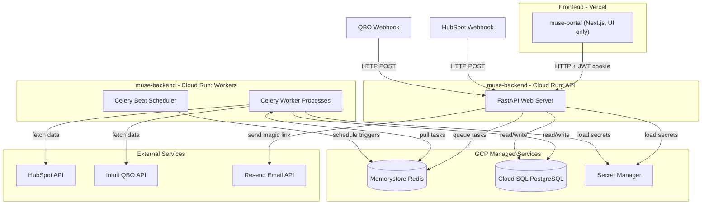
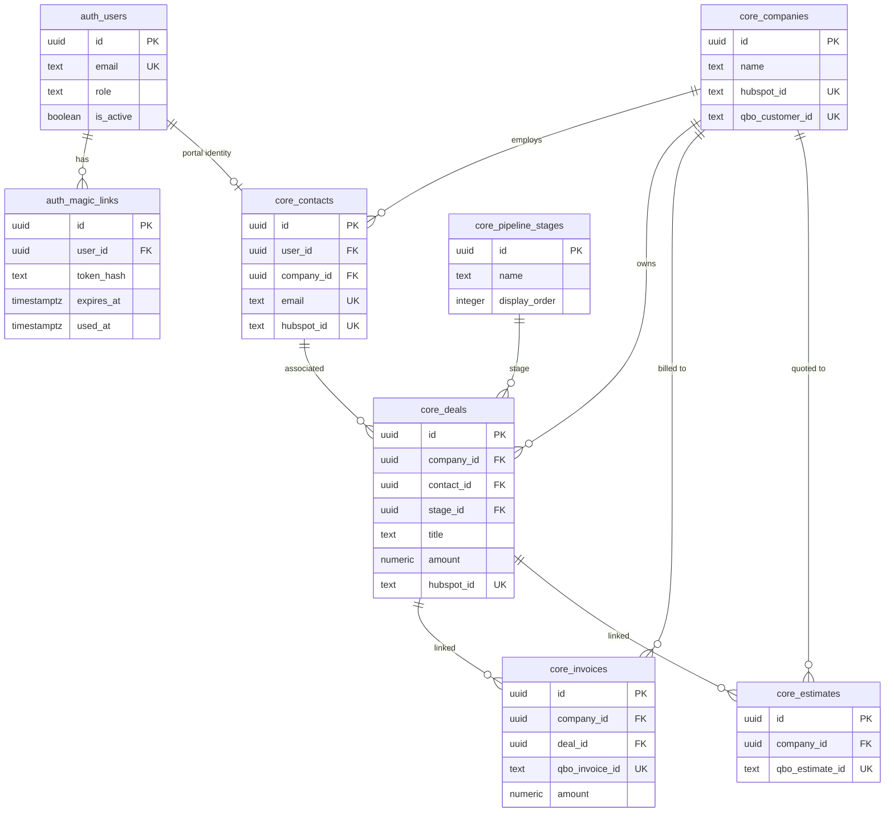
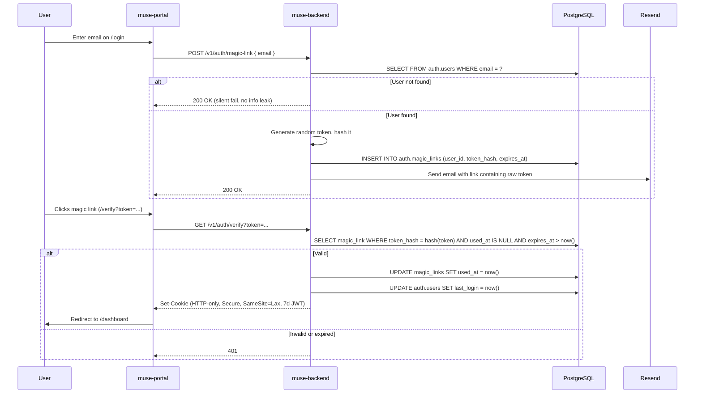

# Architecture: Muse Backend (`muse-backend`)

## 1. Executive Summary

**`muse-backend`** is the centralized Python backend for Muse Semiconductor's internal operations platform. It replaces all server-side logic currently spread across:

- The Next.js Portal's `/api` routes and backend modules (~1,300 lines of auth, HubSpot, QBO, GCP code).
- The legacy `python_applications` cron scripts (40+ scripts for HubSpot, QBO, Box, Dropbox, TSMC, etc.).

After this project is complete:

- **The Next.js Portal (`muse-portal`)** becomes a pure React frontend with zero backend logic. It calls `muse-backend` for everything.
- **The legacy Python scripts (`muse-scripts`)** are gradually migrated into `muse-backend` as Celery tasks.
- **HubSpot** is decommissioned over three phases. All CRM data (users, deals, companies) lives in PostgreSQL.
- **QuickBooks Online** remains as the permanent external accounting system. `muse-backend` owns the OAuth lifecycle and syncs accounting data into PostgreSQL.

---

## 2. Technology Stack

| Layer | Choice | Why |
|---|---|---|
| **Language** | Python 3.12+ | Existing Python codebase (`python_applications`); superior JSON/data manipulation; reuse of `hsapi_token`, `qbo_module`, `box_webhook_listener` |
| **Web Framework** | FastAPI | Async, automatic OpenAPI/Swagger, Pydantic validation, extremely fast |
| **Background Jobs** | Celery + RedBeat | Replaces GCP Cloud Scheduler + Pub/Sub; native rate limiting, retries with backoff, task chaining, cron scheduling. RedBeat keeps the schedule in Redis and provides a distributed lock so accidental multi-replica Beat can't double-fire (§10.1) |
| **Message Broker** | Redis (GCP Memorystore) | Required by Celery; also holds the RedBeat schedule; replaces the Redis + RQ pattern already used in `box_webhook_listener` |
| **ORM** | SQLAlchemy 2.0 | Dual engines: async (`asyncpg`) for FastAPI, sync (`psycopg2`) for Celery -- same database, different drivers. Multi-schema PostgreSQL support; migration via Alembic |
| **Migrations** | Alembic | Versioned, repeatable schema changes across environments. `include_schemas=True` to cover `auth`/`core`/`raw_sync`/`qbo` |
| **Data Validation** | Pydantic v2 | Strict typing for webhook payloads, API requests/responses, config. `from_attributes=True` on all response models; no `alias_generator` -- wire format is snake_case (§15.3) |
| **Database** | PostgreSQL 15+ on Cloud SQL | Four schemas: `auth`, `core`, `raw_sync`, `qbo` |
| **Object Storage** | GCS bucket `muse-qbo-pdfs` | Cached QBO invoice/estimate PDFs (§5.6) |
| **Secrets** | GCP Secret Manager (env fallback) | Same resolution pattern as the current Portal (`env -> cache -> Secret Manager`) |
| **Email** | Resend (`resend` Python SDK) | Magic link emails (ported from Portal's `modules/email/`) |
| **Logging** | `structlog` + GCP Cloud Logging | Structured JSON logs, auto-ingested on Cloud Run |
| **Error Tracking** | Sentry (`sentry-sdk[fastapi,celery,sqlalchemy]`) | Unhandled exceptions, slow-query breadcrumbs, release tagging for regression attribution (§13.2) |
| **API Contract** | OpenAPI 3.1 (FastAPI-generated) + Schemathesis + `openapi-typescript-codegen` | The portal imports a generated TypeScript SDK so backend field renames are caught at `tsc` time (§14.2, §15) |
| **Containerization** | Docker | Single image, three Cloud Run services (API server, Celery worker, RedBeat scheduler as singleton) |

---

## 3. System Architecture

### 3.1 Component Overview



### 3.2 Data Flow

There are four distinct data flows in the system:

**Flow 1: Portal Request (synchronous)**
Portal sends HTTP request -> FastAPI authenticates JWT -> reads/writes `core` schema -> returns JSON.

**Flow 2: Webhook Ingestion (async, via Celery)**
External source sends webhook -> FastAPI validates HMAC signature -> responds `200` immediately -> queues a Celery task -> Celery worker parses payload -> upserts into `raw_sync` tables -> triggers mapping into `core` tables.

**Flow 3: Hourly Sync (scheduled, via Celery Beat)**
Celery Beat fires on cron schedule -> Celery worker fetches changes from HubSpot/QBO APIs -> upserts into `raw_sync` tables -> triggers mapping into `core` tables.

**Flow 4: Legacy Script Migration (gradual)**
Existing `python_applications` cron scripts -> refactored into Celery tasks -> scheduled via Celery Beat instead of system crontab.

---

## 4. Database Schema Design (PostgreSQL)

**Schemas** in PostgreSQL act like folders or namespaces inside a single database. Instead of putting all tables in the default `public` schema, we organize them into distinct schemas to enforce security boundaries, simplify the HubSpot deprecation, and keep business logic cleanly separated from integration plumbing.

### 4.1 Schema Overview

| Schema | Purpose | Who Reads | Who Writes | Lifetime |
|---|---|---|---|---|
| `auth` | Authentication (users, magic links) | FastAPI (auth endpoints) | FastAPI (auth endpoints) | Permanent |
| `core` | Business domain (deals, customers, invoices, companies) | Portal (via FastAPI), FastAPI | Portal (via FastAPI), mapping workers | Permanent |
| `raw_sync` | Raw JSON from external APIs (HubSpot, QBO) | Mapping workers, debugging | Celery sync/webhook workers | HubSpot tables are temporary; QBO tables are permanent |
| `qbo` | QBO operational data (OAuth tokens) | FastAPI, Celery workers | FastAPI (OAuth flow), Celery (token refresh) | Permanent |

### 4.2 `auth` Schema

Handles passwordless magic-link authentication. Isolated from business data so that a vulnerability in the portal's data layer cannot leak authentication secrets.

#### `auth.users`

| Column | Type | Constraints | Notes |
|---|---|---|---|
| `id` | `UUID` | PK, default `gen_random_uuid()` | Internal user ID |
| `email` | `TEXT` | UNIQUE, NOT NULL | Login identity; initially seeded from HubSpot contacts |
| `display_name` | `TEXT` | | Full name for UI display |
| `role` | `TEXT` | NOT NULL, default `'customer'` | `'admin'` / `'customer'` (replaces `ADMIN_EMAILS` env var) |
| `is_active` | `BOOLEAN` | NOT NULL, default `true` | Soft-disable without deleting |
| `last_login` | `TIMESTAMPTZ` | | |
| `created_at` | `TIMESTAMPTZ` | NOT NULL, default `now()` | |
| `updated_at` | `TIMESTAMPTZ` | NOT NULL, default `now()` | |

**Index:** `(email)` -- unique index handles login lookups.

#### `auth.magic_links`

| Column | Type | Constraints | Notes |
|---|---|---|---|
| `id` | `UUID` | PK, default `gen_random_uuid()` | |
| `user_id` | `UUID` | FK -> `auth.users(id)` ON DELETE CASCADE | |
| `token_hash` | `TEXT` | NOT NULL | SHA-256 of the token emailed via Resend |
| `expires_at` | `TIMESTAMPTZ` | NOT NULL | 15 minutes from creation |
| `used_at` | `TIMESTAMPTZ` | | Nullable. Set on first use; prevents replay attacks |
| `created_at` | `TIMESTAMPTZ` | NOT NULL, default `now()` | |

**Index:** `(token_hash)` -- fast lookup when user clicks the magic link.
**Cleanup:** A scheduled Celery task purges rows older than 24 hours.

### 4.3 `core` Schema

The business domain model. **The Next.js Portal reads and writes exclusively to this schema** (via FastAPI endpoints). It does not know HubSpot or QBO exist.

During Phase 1, data is mapped from `raw_sync` into `core` via Celery mapping tasks. During Phase 3, the portal writes directly to `core`.

#### `core.companies`

| Column | Type | Constraints | Notes |
|---|---|---|---|
| `id` | `UUID` | PK, default `gen_random_uuid()` | Internal ID |
| `name` | `TEXT` | NOT NULL | |
| `domain` | `TEXT` | | Company website domain |
| `hubspot_id` | `TEXT` | UNIQUE, nullable | HubSpot company ID (for mapping during Phase 1/2; nullable after Phase 3) |
| `qbo_customer_id` | `TEXT` | UNIQUE, nullable | QBO Customer ID (permanent link to accounting) |
| `source_updated_at` | `TIMESTAMPTZ` | | Max `source_updated_at` of the `raw_sync` row(s) that wrote this record; used by the mapper's chronological guard |
| `deleted_at` | `TIMESTAMPTZ` | | Tombstone. Set when a deletion event/reconcile run observes the record is gone upstream. Portal queries filter `WHERE deleted_at IS NULL` |
| `created_at` | `TIMESTAMPTZ` | NOT NULL, default `now()` | |
| `updated_at` | `TIMESTAMPTZ` | NOT NULL, default `now()` | |

#### `core.contacts`

| Column | Type | Constraints | Notes |
|---|---|---|---|
| `id` | `UUID` | PK, default `gen_random_uuid()` | |
| `user_id` | `UUID` | FK -> `auth.users(id)`, nullable | Link to auth identity (set when contact has portal access). The linkage is by UUID, not email, so email changes on either side do not break it |
| `company_id` | `UUID` | FK -> `core.companies(id)`, nullable | |
| `first_name` | `TEXT` | | |
| `last_name` | `TEXT` | | |
| `email` | `TEXT` | UNIQUE, NOT NULL | |
| `phone` | `TEXT` | | |
| `hubspot_id` | `TEXT` | UNIQUE, nullable | Removed after Phase 3 |
| `source_updated_at` | `TIMESTAMPTZ` | | Chronological guard for mapper upserts |
| `deleted_at` | `TIMESTAMPTZ` | | Tombstone (see `core.companies`) |
| `created_at` | `TIMESTAMPTZ` | NOT NULL, default `now()` | |
| `updated_at` | `TIMESTAMPTZ` | NOT NULL, default `now()` | |

**Index:** `(company_id)` -- list contacts by company.

#### `core.pipeline_stages`

| Column | Type | Constraints | Notes |
|---|---|---|---|
| `id` | `UUID` | PK | |
| `name` | `TEXT` | NOT NULL | e.g. "Qualification", "Proposal", "Closed Won" |
| `display_order` | `INTEGER` | NOT NULL | Sort order in the portal UI |
| `pipeline_name` | `TEXT` | NOT NULL, default `'default'` | Supports multiple pipelines |
| `hubspot_stage_id` | `TEXT` | UNIQUE, nullable | For Phase 1/2 mapping |

#### `core.deals`

| Column | Type | Constraints | Notes |
|---|---|---|---|
| `id` | `UUID` | PK, default `gen_random_uuid()` | |
| `company_id` | `UUID` | FK -> `core.companies(id)` | |
| `contact_id` | `UUID` | FK -> `core.contacts(id)`, nullable | Primary contact on the deal |
| `stage_id` | `UUID` | FK -> `core.pipeline_stages(id)` | |
| `title` | `TEXT` | NOT NULL | Deal name |
| `amount` | `NUMERIC(12,2)` | | Expected revenue |
| `currency` | `TEXT` | default `'USD'` | |
| `close_date` | `DATE` | | |
| `technology` | `TEXT` | | e.g. semiconductor process node |
| `hubspot_id` | `TEXT` | UNIQUE, nullable | Removed after Phase 3 |
| `owner_user_id` | `UUID` | FK -> `auth.users(id)`, nullable | Internal deal owner |
| `properties_json` | `JSONB` | | Overflow for custom/unmapped HubSpot properties |
| `source_updated_at` | `TIMESTAMPTZ` | | Chronological guard for mapper upserts |
| `deleted_at` | `TIMESTAMPTZ` | | Tombstone (see `core.companies`) |
| `created_at` | `TIMESTAMPTZ` | NOT NULL, default `now()` | |
| `updated_at` | `TIMESTAMPTZ` | NOT NULL, default `now()` | |

**Indexes:**
- `(company_id)` -- portal dashboard groups deals by company
- `(contact_id)` -- deal access check (which contact can see which deals)
- `(stage_id)` -- filter by pipeline stage
- `(hubspot_id)` -- mapping during sync
- `(deleted_at)` partial index `WHERE deleted_at IS NULL` -- portal queries always filter live rows

#### `core.invoices`

| Column | Type | Constraints | Notes |
|---|---|---|---|
| `id` | `UUID` | PK, default `gen_random_uuid()` | |
| `company_id` | `UUID` | FK -> `core.companies(id)` | |
| `deal_id` | `UUID` | FK -> `core.deals(id)`, nullable | Optional link to deal |
| `qbo_invoice_id` | `TEXT` | UNIQUE, NOT NULL | Permanent link to QBO |
| `invoice_number` | `TEXT` | | QBO doc number |
| `amount` | `NUMERIC(12,2)` | | |
| `balance_due` | `NUMERIC(12,2)` | | |
| `currency` | `TEXT` | default `'USD'` | |
| `status` | `TEXT` | | `'draft'` / `'sent'` / `'paid'` / `'overdue'` |
| `due_date` | `DATE` | | |
| `issued_date` | `DATE` | | |
| `line_items_json` | `JSONB` | | Array of line items from QBO |
| `synced_at` | `TIMESTAMPTZ` | | Last time this row was updated from QBO |
| `source_updated_at` | `TIMESTAMPTZ` | | Chronological guard for mapper upserts (from QBO `MetaData.LastUpdatedTime`) |
| `deleted_at` | `TIMESTAMPTZ` | | Tombstone. Populated from QBO CDC `status='Deleted'` responses. Portal filters `WHERE deleted_at IS NULL` |
| `pdf_gcs_path` | `TEXT` | | GCS object path for the cached QBO-rendered PDF. `NULL` means cache miss (first request lazily fetches and caches). See §5.6 |
| `pdf_cached_at` | `TIMESTAMPTZ` | | When the PDF was last fetched from QBO. Cleared to `NULL` on QBO webhook updates for cache invalidation |
| `created_at` | `TIMESTAMPTZ` | NOT NULL, default `now()` | |
| `updated_at` | `TIMESTAMPTZ` | NOT NULL, default `now()` | |

**Indexes:**
- `(company_id)` -- list invoices per company
- `(qbo_invoice_id)` -- unique, for upserts from QBO sync
- `(deleted_at)` partial index `WHERE deleted_at IS NULL` -- portal queries always filter live rows

#### `core.estimates`

| Column | Type | Constraints | Notes |
|---|---|---|---|
| `id` | `UUID` | PK, default `gen_random_uuid()` | |
| `company_id` | `UUID` | FK -> `core.companies(id)` | |
| `deal_id` | `UUID` | FK -> `core.deals(id)`, nullable | |
| `qbo_estimate_id` | `TEXT` | UNIQUE, NOT NULL | |
| `estimate_number` | `TEXT` | | |
| `amount` | `NUMERIC(12,2)` | | |
| `status` | `TEXT` | | |
| `expiry_date` | `DATE` | | |
| `line_items_json` | `JSONB` | | |
| `synced_at` | `TIMESTAMPTZ` | | |
| `source_updated_at` | `TIMESTAMPTZ` | | Chronological guard for mapper upserts |
| `deleted_at` | `TIMESTAMPTZ` | | Tombstone from QBO CDC |
| `pdf_gcs_path` | `TEXT` | | GCS object path for the cached QBO PDF. See §5.6 |
| `pdf_cached_at` | `TIMESTAMPTZ` | | When the PDF was last fetched; cleared on QBO webhook updates |
| `created_at` | `TIMESTAMPTZ` | NOT NULL, default `now()` | |
| `updated_at` | `TIMESTAMPTZ` | NOT NULL, default `now()` | |

#### `core.purchase_orders`

| Column | Type | Constraints | Notes |
|---|---|---|---|
| `id` | `UUID` | PK, default `gen_random_uuid()` | |
| `company_id` | `UUID` | FK -> `core.companies(id)` | |
| `deal_id` | `UUID` | FK -> `core.deals(id)`, nullable | |
| `qbo_po_id` | `TEXT` | UNIQUE, NOT NULL | |
| `po_number` | `TEXT` | | |
| `amount` | `NUMERIC(12,2)` | | |
| `status` | `TEXT` | | |
| `vendor_name` | `TEXT` | | |
| `line_items_json` | `JSONB` | | |
| `synced_at` | `TIMESTAMPTZ` | | |
| `source_updated_at` | `TIMESTAMPTZ` | | Chronological guard for mapper upserts |
| `deleted_at` | `TIMESTAMPTZ` | | Tombstone from QBO CDC |
| `created_at` | `TIMESTAMPTZ` | NOT NULL, default `now()` | |
| `updated_at` | `TIMESTAMPTZ` | NOT NULL, default `now()` | |

#### `core.mapping_bookmarks`

Tracks the mapper's progress through `raw_sync.*_records.version`. One row per connector. Lets the mapper pick up rows with `version > last_version` instead of re-scanning the world on every run.

| Column | Type | Constraints | Notes |
|---|---|---|---|
| `connector` | `TEXT` | PK | `'hubspot'` or `'qbo'` |
| `last_version` | `BIGINT` | NOT NULL, default `0` | Highest `raw_sync.*_records.version` the mapper has processed |
| `last_run_at` | `TIMESTAMPTZ` | | Last successful mapping run |
| `updated_at` | `TIMESTAMPTZ` | NOT NULL, default `now()` | |

### 4.4 `raw_sync` Schema

Holds the exact JSON payloads as they arrive from HubSpot and QBO. Acts as an isolated data lake. HubSpot and QBO have **separate tables** so that decommissioning HubSpot is an instant `DROP TABLE` (no expensive `DELETE` + `VACUUM`).

#### `raw_sync.hubspot_sync_runs` / `raw_sync.qbo_sync_runs`

| Column | Type | Notes |
|---|---|---|
| `id` | `UUID` | PK |
| `object_type` | `TEXT` | `'contact'`, `'company'`, `'deal'`, `'association'`, `'invoice'`, etc. |
| `started_at` | `TIMESTAMPTZ` | |
| `finished_at` | `TIMESTAMPTZ` | |
| `status` | `TEXT` | `'running'` / `'completed'` / `'failed'` |
| `error` | `TEXT` | nullable |
| `cursor_bookmark` | `JSONB` | `{ "after": "...", "page": 3 }` for mid-run resume |
| `window_start` | `TIMESTAMPTZ` | |
| `window_end` | `TIMESTAMPTZ` | |
| `records_synced` | `INTEGER` | |

**Index:** `(object_type, status, started_at)` for "last successful run" lookups.

#### `raw_sync.hubspot_webhook_events` / `raw_sync.qbo_webhook_events`

| Column | Type | Notes |
|---|---|---|
| `id` | `TEXT` | PK. Event unique ID from source (idempotency) |
| `received_at` | `TIMESTAMPTZ` | when this service received it |
| `source_updated_at` | `TIMESTAMPTZ` | when the source says the change happened |
| `object_type` | `TEXT` | |
| `source_id` | `TEXT` | |
| `payload_json` | `JSONB` | raw event payload |

**Index:** `(object_type, received_at)` -- debugging and replay.
**Partitioning:** range-partition by `received_at` (monthly) for fast queries and cheap old-partition drops.

#### `raw_sync.hubspot_records` / `raw_sync.qbo_records`

| Column | Type | Notes |
|---|---|---|
| `id` | `UUID` | PK |
| `object_type` | `TEXT` | |
| `source_id` | `TEXT` | |
| `source_updated_at` | `TIMESTAMPTZ` | when the source last changed it |
| `created_at` | `TIMESTAMPTZ` | when this service first saw the record |
| `updated_at` | `TIMESTAMPTZ` | when this service last upserted it |
| `deleted_at` | `TIMESTAMPTZ` | tombstone: marks if the record was deleted in the source |
| `content_hash` | `TEXT` | SHA-256 of `payload_json` for change detection |
| `version` | `BIGINT` | monotonically increasing for incremental polling |
| `payload_json` | `JSONB` | full canonical payload |

**Unique constraint:** `(object_type, source_id)` -- upsert key.
**Indexes:**
- `(object_type, source_updated_at)` -- time-range queries
- `(version)` -- incremental polling
- GIN on `payload_json` -- ad-hoc JSONB queries

**Critical upsert rule:** All upserts must include a chronological guard:
```sql
INSERT INTO raw_sync.hubspot_records (...) VALUES (...)
ON CONFLICT (object_type, source_id)
DO UPDATE SET ...
WHERE raw_sync.hubspot_records.source_updated_at < EXCLUDED.source_updated_at;
```
This prevents out-of-order webhook delivery or sync/webhook race conditions from overwriting newer data with older data.

### 4.5 `qbo` Schema

Operational data specific to the QuickBooks Online integration. Separated because QBO OAuth tokens are highly sensitive and require strict access control.

#### `qbo.oauth_tokens`

| Column | Type | Constraints | Notes |
|---|---|---|---|
| `realm_id` | `TEXT` | PK | QBO company ID (matches `QBO_REALM_ID`) |
| `access_token` | `TEXT` | NOT NULL | Short-lived (60 mins) |
| `refresh_token` | `TEXT` | NOT NULL | Long-lived (100 days), rotates upon use |
| `access_token_expires_at` | `TIMESTAMPTZ` | NOT NULL | |
| `refresh_token_expires_at` | `TIMESTAMPTZ` | NOT NULL | |
| `updated_at` | `TIMESTAMPTZ` | NOT NULL, default `now()` | |

**Note:** Replaces the Firestore `qbo_connections` collection. The FastAPI service and Celery workers both read/write this table. Token refresh uses a Postgres advisory lock to prevent race conditions when multiple processes attempt to refresh simultaneously.

### 4.6 Schema Relationship Diagram



---

## 5. API Surface

### 5.1 Authentication Endpoints (Unauthenticated)

| Method | Path | Description |
|---|---|---|
| `POST` | `/v1/auth/magic-link` | Send magic link email. Body: `{ email }`. Validates user exists in `auth.users`. |
| `GET` | `/v1/auth/verify` | Verify magic link token, set session cookie. Query: `?token=...` |
| `POST` | `/v1/auth/logout` | Clear session cookie. |

### 5.2 Portal Data Endpoints (JWT Required)

| Method | Path | Description |
|---|---|---|
| `GET` | `/v1/deals` | List deals for authenticated contact, grouped by company. Supports filters: `stage`, `company`, `technology`, `date_range`. |
| `GET` | `/v1/deals/{id}` | Deal detail. Enforces contact-deal association access check. |
| `GET` | `/v1/companies` | List companies visible to authenticated contact. |
| `GET` | `/v1/invoices` | List invoices. Filters: `company_id`, `status`, `customer_name`, `muse_part_number`. |
| `GET` | `/v1/invoices/{id}/pdf` | Return a signed GCS URL for the cached PDF when `pdf_gcs_path` is set; otherwise fetch from QBO, upload to GCS, persist `pdf_gcs_path` + `pdf_cached_at`, return the signed URL. See §5.6 for the cache-invalidation contract. |
| `GET` | `/v1/estimates` | List estimates. Filters: `company_id`, `muse_part_number`. |
| `GET` | `/v1/estimates/{id}/pdf` | Same cache-first flow as `/v1/invoices/{id}/pdf`. |
| `GET` | `/v1/purchase-orders` | List purchase orders. |
| `GET` | `/v1/sync/status` | Last successful sync timestamps per connector and object type. |

### 5.3 Admin Endpoints (JWT Required + Admin Role)

| Method | Path | Description |
|---|---|---|
| `GET` | `/v1/admin/qbo/connect` | Initiate QBO OAuth flow (redirect to Intuit). |
| `GET` | `/v1/admin/qbo/callback` | Handle QBO OAuth callback, store tokens in `qbo.oauth_tokens`. |
| `GET` | `/v1/admin/users` | List all users. |
| `POST` | `/v1/admin/users` | Create / invite a user. |
| `PATCH` | `/v1/admin/users/{id}` | Update user role, active status. |

### 5.4 Webhook Endpoints (HMAC Signature Required)

| Method | Path | Description |
|---|---|---|
| `POST` | `/v1/webhooks/hubspot` | Verify HubSpot HMAC v3 signature, queue Celery task. |
| `POST` | `/v1/webhooks/qbo` | Verify QBO HMAC signature, queue Celery task. |

### 5.5 Infrastructure (Unauthenticated)

| Method | Path | Description |
|---|---|---|
| `GET` | `/v1/health` | Liveness/readiness probe for Cloud Run. |
| `GET` | `/docs` | Auto-generated Swagger UI (FastAPI built-in). |
| `GET` | `/openapi.json` | OpenAPI 3.1 spec (FastAPI built-in). |

### 5.6 QBO PDF Cache Contract

QBO's `/invoice/{id}/pdf` and `/estimate/{id}/pdf` endpoints are slow (typically 2-5s). Proxying them on every portal request is unacceptable. Instead:

**Storage layout:**

- GCS bucket: `muse-qbo-pdfs` (separate bucket, object-level access).
- Object key: `invoices/{qbo_invoice_id}/{content_hash}.pdf` (and `estimates/{qbo_estimate_id}/{content_hash}.pdf`).
- `content_hash` embedded in the key means a regeneration never overwrites a URL that's currently being served.

**Read path (`GET /v1/invoices/{id}/pdf`):**

1. Load `core.invoices` by `id`. Check access control against the caller's contact.
2. If `pdf_gcs_path IS NOT NULL`, mint a V4 signed URL (15-minute lifetime) and return `{ url, expires_at }`.
3. Otherwise: fetch the PDF from QBO, upload to GCS at the object key above, `UPDATE core.invoices SET pdf_gcs_path = ?, pdf_cached_at = now()`, then mint and return the signed URL.
4. The portal follows the URL directly from the browser; the backend is not in the byte path.

**Invalidation:**

- On every QBO webhook for an invoice/estimate, the webhook processor (§6.2) clears `pdf_gcs_path = NULL, pdf_cached_at = NULL`. The next portal request re-fetches. The old GCS object is left in place and reaped by a lifecycle rule (30-day TTL on objects unreferenced by any row -- enforced by a monthly cleanup task, not by GCS lifecycle policy, because lifecycle can't see DB state).
- A manual admin refresh endpoint is not needed; re-caching is automatic on next access.

**Why cache lazily instead of eagerly:**

Most invoices are never viewed. Eagerly generating PDFs on sync would waste GCS storage and QBO rate-limit budget. Lazy caching pays the 3-5s penalty once per viewed invoice, then every subsequent view is <200ms.

---

## 6. Celery Task Design

### 6.1 Celery Beat Schedule (Cron)

| Task | Schedule | Description |
|---|---|---|
| `sync_hubspot_contacts` | Every hour | Fetch changed contacts from HubSpot API |
| `sync_hubspot_companies` | Every hour | Fetch changed companies |
| `sync_hubspot_deals` | Every hour | Fetch changed deals |
| `sync_hubspot_associations` | Every hour (after above) | Fetch contact-deal-company links |
| `sync_qbo_invoices` | Every hour | Fetch changed invoices from QBO API (uses CDC; includes `status='Deleted'`) |
| `sync_qbo_estimates` | Every hour | Fetch changed estimates (CDC) |
| `sync_qbo_purchase_orders` | Every hour | Fetch changed POs (CDC) |
| `sync_qbo_customers` | Every hour | Fetch changed QBO customers (CDC) |
| `map_hubspot_to_core` | Every hour (after HS sync) | Map `raw_sync.hubspot_records` -> `core` tables |
| `map_qbo_to_core` | Every hour (after QBO sync) | Map `raw_sync.qbo_records` -> `core` tables |
| `reconcile_hubspot_deletions` | Weekly, Sunday 02:00 UTC | Safety net for missed deletion webhooks. See §6.5 |
| `cleanup_orphan_pdfs` | Monthly, 1st @ 04:00 UTC | Delete GCS PDF objects no longer referenced by any `core.invoices` / `core.estimates` row |
| `cleanup_expired_magic_links` | Daily at 3 AM | Purge `auth.magic_links` older than 24 hours |

### 6.2 Webhook Processing Tasks (On-Demand)

| Task | Triggered By | Description |
|---|---|---|
| `process_hubspot_webhook` | `POST /v1/webhooks/hubspot` | Parse event, upsert `raw_sync.hubspot_webhook_events` + `raw_sync.hubspot_records` (set `deleted_at` on `*.deletion` events), then map to `core` |
| `process_qbo_webhook` | `POST /v1/webhooks/qbo` | Parse event, upsert `raw_sync.qbo_webhook_events` + `raw_sync.qbo_records`, then map to `core`. For invoice/estimate update events, additionally `UPDATE core.<table> SET pdf_gcs_path = NULL, pdf_cached_at = NULL WHERE qbo_*_id = ?` to invalidate the PDF cache (see §5.6) |

### 6.3 Task Configuration

```python
@app.task(
    bind=True,
    autoretry_for=(Exception,),
    retry_backoff=True,         # exponential backoff
    retry_backoff_max=600,      # max 10 minutes between retries
    max_retries=5,
    rate_limit="10/s",          # HubSpot: ~100 req/10s
)
def sync_hubspot_contacts(self):
    ...
```

### 6.4 Task Chaining (Hourly Sync Pipeline)

The hourly sync uses Celery `chain()` to ensure correct ordering:

```python
from celery import chain, group

hourly_hubspot_sync = chain(
    group(
        sync_hubspot_contacts.s(),
        sync_hubspot_companies.s(),
        sync_hubspot_deals.s(),
    ),
    sync_hubspot_associations.s(),
    map_hubspot_to_core.s(),
)
```

Contacts, companies, and deals sync in parallel (they are independent API calls). Associations sync after all three complete (they reference the synced objects). Mapping to `core` runs last.

### 6.5 HubSpot Deletion Reconcile (`reconcile_hubspot_deletions`)

HubSpot's `/crm/v3/objects/{type}/search` endpoint, filtered by `hs_lastmodifieddate`, is the backbone of the hourly sync -- but **deleted records never appear in its results**. Deletions are only surfaced via `*.deletion` webhook events. If a webhook is lost (HubSpot outage, our endpoint returns non-2xx during a deploy, a partition drop on our webhook table, etc.), the record lingers in `raw_sync.hubspot_records` and `core` forever.

QBO does not have this problem: its CDC endpoint returns deleted entities with `status='Deleted'`, so scheduled sync handles it natively.

**Weekly safety net:**

```python
@shared_task(bind=True)
def reconcile_hubspot_deletions(self):
    for object_type in ("contact", "company", "deal"):
        live_ids_upstream: set[str] = fetch_all_ids_from_hubspot(object_type)  # paginated
        known_ids_local: set[str] = db.query(
            "SELECT source_id FROM raw_sync.hubspot_records "
            "WHERE object_type = :t AND deleted_at IS NULL",
            t=object_type,
        )
        missing = known_ids_local - live_ids_upstream
        if missing:
            db.execute(
                "UPDATE raw_sync.hubspot_records SET deleted_at = now() "
                "WHERE object_type = :t AND source_id = ANY(:ids)",
                t=object_type, ids=list(missing),
            )
            # The mapper on next run propagates deleted_at to the core.* row.
```

**Why this is safe to run every week rather than daily:**

- HubSpot webhook delivery is reliable (~99.9%); the reconcile is purely belt-and-suspenders.
- The full-list-ids scan is expensive (~1 API page per 100 records). Weekly keeps the rate-limit budget modest.
- A deleted record in `core` for up to 7 days is acceptable -- the portal never shows stale deals to customers (access control is by live association), and finance data comes from QBO.

**Out of scope for this task:**

- Actual hard-deletion of tombstoned rows from `core`. Tombstoning is enough; rows stay for audit.

---

## 7. Authentication & Security

### 7.1 Magic Link Flow



### 7.2 JWT Session Cookie

- **Algorithm:** HS256 (symmetric, shared `AUTH_SECRET` between Portal and Backend).
- **Payload:** `{ "sub": "<user_id>", "email": "<email>", "role": "<role>", "exp": <7 days> }`.
- **Storage:** HTTP-only, Secure (in production), SameSite=Lax cookie named `muse_session`.
- **Verification:** FastAPI dependency (`get_current_user`) decodes and validates the JWT on every protected request.

### 7.3 Webhook HMAC Verification

- **HubSpot:** v3 signature validation (SHA-256 HMAC of `client_secret + method + URI + body + timestamp`). Fail closed: reject with 403 if invalid.
- **QBO:** Intuit webhook signature verification using `HMAC-SHA256` with the verifier token. Fail closed.
- Both use `fastapi-raw-body` equivalent (or `Request.body()`) to capture the exact raw bytes for hashing.

### 7.4 Role-Based Access

| Role | Portal Access | Admin Endpoints | Deal Visibility |
|---|---|---|---|
| `customer` | Dashboard, own deals, invoices | No | Only deals associated with their contact |
| `admin` | Full dashboard | Yes (user management, QBO connect) | All deals |

### 7.5 Database Access Control

| DB User | `auth` | `core` | `raw_sync` | `qbo` |
|---|---|---|---|---|
| `api_user` (FastAPI) | READ/WRITE | READ/WRITE | READ | READ/WRITE |
| `worker_user` (Celery) | NONE | READ/WRITE | READ/WRITE | READ/WRITE |
| `readonly_user` (debugging) | NONE | READ | READ | NONE |

---

## 8. Project Structure

```
muse-backend/
├── app/
│   ├── __init__.py
│   ├── main.py                              # FastAPI app factory, middleware, route registration
│   ├── core/
│   │   ├── __init__.py
│   │   ├── config.py                        # Pydantic BaseSettings (env + Secret Manager resolution)
│   │   ├── security.py                      # JWT decode/verify, get_current_user dependency
│   │   └── exceptions.py                    # Custom HTTP exceptions
│   ├── db/
│   │   ├── __init__.py
│   │   ├── session.py                       # SQLAlchemy async engine, sessionmaker, get_db dependency
│   │   ├── base.py                          # Declarative base
│   │   └── models/
│   │       ├── __init__.py
│   │       ├── auth.py                      # User, MagicLink
│   │       ├── core.py                      # Company, Contact, Deal, PipelineStage, Invoice, ...
│   │       ├── raw_sync.py                  # HubspotRecord, QboRecord, SyncRun, WebhookEvent
│   │       └── qbo.py                       # OAuthToken
│   ├── api/
│   │   ├── __init__.py
│   │   ├── deps.py                          # Shared dependencies (db session, current user, admin check)
│   │   └── v1/
│   │       ├── __init__.py
│   │       ├── router.py                    # Aggregates all v1 routers
│   │       ├── auth.py                      # /auth/magic-link, /auth/verify, /auth/logout
│   │       ├── deals.py                     # /deals, /deals/{id}
│   │       ├── companies.py                 # /companies
│   │       ├── invoices.py                  # /invoices, /invoices/{id}/pdf
│   │       ├── estimates.py                 # /estimates, /estimates/{id}/pdf
│   │       ├── purchase_orders.py           # /purchase-orders
│   │       ├── sync_status.py               # /sync/status
│   │       ├── admin.py                     # /admin/users, /admin/qbo/connect, /admin/qbo/callback
│   │       ├── webhooks.py                  # /webhooks/hubspot, /webhooks/qbo
│   │       └── health.py                    # /health
│   ├── worker/
│   │   ├── __init__.py
│   │   ├── celery_app.py                    # Celery + Beat initialization, broker config
│   │   ├── tasks_hubspot_sync.py            # Hourly HubSpot sync tasks
│   │   ├── tasks_qbo_sync.py               # Hourly QBO sync tasks
│   │   ├── tasks_hubspot_webhook.py         # HubSpot webhook processing
│   │   ├── tasks_qbo_webhook.py             # QBO webhook processing
│   │   ├── tasks_mapping.py                 # raw_sync -> core mapping logic
│   │   └── tasks_maintenance.py             # Cleanup expired magic links, etc.
│   ├── integrations/
│   │   ├── __init__.py
│   │   ├── hubspot.py                       # HubSpot API client (refactored from hsapi_token.py)
│   │   ├── qbo.py                           # QBO API client (refactored from qbo_module)
│   │   ├── qbo_oauth.py                     # QBO OAuth flow (connect, callback, token refresh)
│   │   ├── resend_email.py                  # Send magic link emails via Resend
│   │   └── gcp_secrets.py                   # getSecret(): env -> cache -> Secret Manager
│   └── services/
│       ├── __init__.py
│       ├── auth_service.py                  # Magic link creation, verification, session management
│       ├── deal_service.py                  # Deal queries, access control, grouping by company
│       ├── invoice_service.py               # Invoice queries, PDF proxy
│       └── mapping_service.py               # raw_sync -> core transformation logic
├── alembic/
│   ├── env.py                               # Alembic environment config
│   ├── versions/
│   │   └── 001_create_schemas_and_tables.py # Initial migration
│   └── script.py.mako
├── alembic.ini
├── tests/
│   ├── conftest.py                          # pytest fixtures (test DB, test client, factory functions)
│   ├── test_auth.py
│   ├── test_deals.py
│   ├── test_webhooks.py
│   ├── test_sync_tasks.py
│   └── test_mapping.py
├── requirements.txt
├── Dockerfile
├── docker-compose.yml                       # Local dev: FastAPI + Celery + Redis + Postgres
├── .env.example
└── README.md
```

---

## 9. Secrets & Configuration

All secrets are resolved via `app/integrations/gcp_secrets.py` using the same pattern as the current Portal: `env var -> in-memory cache -> GCP Secret Manager`.

| Secret | Purpose |
|---|---|
| `DATABASE_URL` | PostgreSQL connection string |
| `REDIS_URL` | Redis connection for Celery broker |
| `AUTH_SECRET` | HS256 JWT signing/verification (must match Portal's `AUTH_SECRET`) |
| `HUBSPOT_ACCESS_TOKEN` | HubSpot private app token (Phase 1/2 only) |
| `HUBSPOT_WEBHOOK_SECRET` | HubSpot HMAC v3 client secret |
| `QBO_CLIENT_ID` | Intuit OAuth client ID |
| `QBO_CLIENT_SECRET` | Intuit OAuth client secret |
| `QBO_WEBHOOK_VERIFIER_TOKEN` | QBO webhook HMAC verifier |
| `QBO_REALM_ID` | Default QBO company ID (single-tenant) |
| `QBO_ENVIRONMENT` | `sandbox` or `production` |
| `RESEND_API_KEY` | Resend email service |
| `FROM_EMAIL` | Sender address for magic links |
| `GOOGLE_CLOUD_PROJECT` | GCP project ID (for Secret Manager) |
| `GCS_PDF_BUCKET` | GCS bucket name for cached QBO PDFs (§5.6), e.g. `muse-qbo-pdfs` |
| `SENTRY_DSN` | Sentry project DSN for error tracking (§13.2). Optional in development, required in staging/production |
| `SENTRY_ENVIRONMENT` | `development` / `staging` / `production` -- used for Sentry event tagging |
| `GIT_SHA` | Injected at container build time; used as Sentry `release` tag for regression attribution |
| `ADMIN_EMAILS` | Comma-separated list (seed for `auth.users` with `role = 'admin'`; not cached so changes apply without restart) |

Startup validation via Pydantic `BaseSettings`: the application refuses to start if any required secret is missing.

---

## 10. Deployment

### 10.1 Container Strategy

One Docker image, three entrypoints:

| Cloud Run Service | Command | Scaling | Purpose |
|---|---|---|---|
| `muse-backend-api` | `uvicorn app.main:app --host 0.0.0.0 --port 8080` | min=1, max=10, autoscale on CPU/concurrency | HTTP API server |
| `muse-backend-worker` | `celery -A app.worker.celery_app worker -l info -c 4` | min=1, max=5, autoscale on queue depth (custom metric) | Background task processor |
| `muse-backend-beat` | `celery -A app.worker.celery_app beat -l info -S redbeat.RedBeatScheduler` | **min=1, max=1** (hard singleton) | Cron scheduler |

**Beat singleton is mandatory.** Two Beat instances would fire every scheduled task twice. Enforce this by:

1. Setting `min_instances = max_instances = 1` on the Cloud Run service.
2. Disabling CPU / concurrency autoscaling on the Beat service.
3. Using `celery-redbeat` so the schedule lives in Redis, not in a local `celerybeat-schedule` file that vanishes with every container restart. `redbeat` also provides a distributed lock, so even if an operator accidentally scales Beat to 2 replicas, only one actually schedules.

**Worker concurrency (`-c 4`)** is conservative because Cloud Run gives each instance limited memory and each Celery child process holds its own SQLAlchemy connection. See §10.4 for the pool arithmetic.

### 10.2 GCP Infrastructure

| Service | Purpose |
|---|---|
| **Cloud Run** (x3) | API, Worker, Beat |
| **Cloud SQL (PostgreSQL 15)** | Database |
| **Cloud SQL Auth Proxy** | Sidecar on all Cloud Run services |
| **Memorystore (Redis)** | Celery message broker + RedBeat schedule storage |
| **GCS bucket (`muse-qbo-pdfs`)** | Cached QBO PDFs (see §5.6) |
| **Secret Manager** | All secrets |
| **Artifact Registry** | Docker image storage |
| **Sentry (external)** | Error tracking and alerting (see §13) |

### 10.3 Local Development

```yaml
# docker-compose.yml
services:
  api:
    build: .
    command: uvicorn app.main:app --host 0.0.0.0 --port 8080 --reload
    ports: ["8080:8080"]
    env_file: .env
    depends_on: [postgres, redis]

  worker:
    build: .
    command: celery -A app.worker.celery_app worker -l info
    env_file: .env
    depends_on: [postgres, redis]

  beat:
    build: .
    command: celery -A app.worker.celery_app beat -l info
    env_file: .env
    depends_on: [redis]

  postgres:
    image: postgres:15
    environment:
      POSTGRES_DB: muse
      POSTGRES_USER: muse
      POSTGRES_PASSWORD: muse
    ports: ["5432:5432"]
    volumes: [postgres_data:/var/lib/postgresql/data]

  redis:
    image: redis:7-alpine
    ports: ["6379:6379"]

volumes:
  postgres_data:
```

### 10.4 Database Connection Pool Sizing

Cloud SQL (PostgreSQL 15, `db-custom-2-7680` tier) caps total connections at ~100. The backend has two independent pools (async for FastAPI, sync for Celery) running on multiple Cloud Run instances, so pool budgeting is easy to get wrong and hard to notice until traffic spikes exhaust the server.

**Budget (worst case, all services at max replicas):**

| Service | Replicas (max) | Pool per replica | Total |
|---|---|---|---|
| `muse-backend-api` (async `asyncpg`) | 10 | `pool_size=5`, `max_overflow=5` | 100 |
| `muse-backend-worker` (sync `psycopg2`) | 5 × 4 concurrency | `pool_size=1`, `max_overflow=1` per child | 40 |
| `muse-backend-beat` | 1 | `pool_size=1` (no overflow) | 1 |
| Total | | | ~141 |

That exceeds Cloud SQL's 100-connection cap at peak. Mitigations, pick one or combine:

1. **Raise Cloud SQL tier.** `db-custom-4-15360` gives ~200 connections. Cheapest fix.
2. **Lower API pool.** `pool_size=3, max_overflow=3` → 60 + 40 + 1 = 101 (borderline).
3. **Add PgBouncer** in transaction-pooling mode between Cloud Run and Cloud SQL. Required once you have >2 worker replicas with concurrency >4.

Enforce in code:

```python
async_engine = create_async_engine(
    DATABASE_URL,
    pool_size=5, max_overflow=5,
    pool_pre_ping=True,            # detects dropped connections after Cloud SQL failover
    pool_recycle=1800,             # recycle every 30 min; Cloud SQL idle timeout is ~1h
)
sync_engine = create_engine(
    DATABASE_URL,
    pool_size=1, max_overflow=1,   # Celery child = 1 sync task at a time
    pool_pre_ping=True,
    pool_recycle=1800,
)
```

The worker concurrency `-c 4` means Celery forks 4 child processes; each child has its own process-local pool (1 + 1 overflow), so 4 children × 2 = 8 connections per replica.

---

## 11. 3-Phase HubSpot Decommissioning Plan

### Phase 1: Mirroring

- **HubSpot Status:** Source of Truth.
- **Data Flow:** HubSpot -> `raw_sync.hubspot_records` -> mapping worker -> `core` tables (companies, contacts, deals).
- **Portal:** Reads from `core` via `muse-backend` API. Does not write CRM data.
- **Auth:** Magic links validate against `auth.users`, which is seeded from HubSpot contacts during initial migration.
- **QBO:** Syncs into `raw_sync.qbo_records` -> mapping worker -> `core.invoices`, `core.estimates`, etc.

### Phase 2: Co-existence

- **HubSpot Status:** Shared Input.
- **Data Flow:** Some data entered in the Portal (e.g., deal notes, custom fields), some in HubSpot. Both write to `core`.
- **Conflict Resolution:** Field-level authority. Each column in `core.deals` has an explicit owner (HubSpot or Portal). The mapping worker skips columns owned by the Portal. The chronological upsert guard (`source_updated_at`) prevents stale HubSpot data from overwriting newer Portal edits.
- **Portal:** Begins writing to `core` tables via `muse-backend` API (e.g., `PATCH /v1/deals/{id}`).

### Phase 3: Master

- **HubSpot Status:** Decommissioned.
- **Portal:** Full CRUD on `core` tables. Auth validated against `auth.users` (no HubSpot dependency).
- **Cleanup Steps:**
  1. Delete HubSpot webhook subscriptions in the HubSpot developer portal.
  2. Remove `sync_hubspot_*` and `map_hubspot_to_core` Celery tasks from Beat schedule.
  3. Run: `DROP TABLE raw_sync.hubspot_records;`
  4. Run: `DROP TABLE raw_sync.hubspot_webhook_events;`
  5. Run: `DROP TABLE raw_sync.hubspot_sync_runs;`
  6. Remove `hubspot_id` columns from `core` tables (optional migration).
  7. Remove `HUBSPOT_ACCESS_TOKEN` and `HUBSPOT_WEBHOOK_SECRET` from Secret Manager.
  8. Delete `app/integrations/hubspot.py`, `app/worker/tasks_hubspot_*.py`.
- **QBO Continues:** Completely unaffected. `raw_sync.qbo_*` tables and the QBO sync pipeline continue as-is.

---

## 12. Migration Path for Legacy Python Scripts

The existing `python_applications` (now `muse-scripts`) codebase has ~40 operational scripts running on cron. These are migrated gradually into Celery tasks.

### Priority Migration Candidates

| Script | Becomes | Priority |
|---|---|---|
| `hsapi/hsapi_token.py` | `app/integrations/hubspot.py` | Phase 1 (refactor into integration client) |
| `modules/qbo_module/` | `app/integrations/qbo.py` + `qbo_oauth.py` | Phase 1 (refactor into integration client) |
| `box_webhook_listener/` | `app/api/v1/webhooks.py` + `app/worker/tasks_box.py` | Phase 1 (already uses Flask + Redis + RQ) |
| `hs_to_qbo.py` | `app/worker/tasks_mapping.py` | Phase 2 |
| `milestone_emails/` | `app/worker/tasks_notifications.py` | Phase 2 |
| `modules/gmail_module/sendmail.py` | `app/integrations/resend_email.py` (replace Gmail with Resend) | Phase 2 |
| `modules/muse_utility/` | Shared constants move into `app/core/config.py` | Phase 1 |

Scripts that interact with TSMC, FedEx, KLayout, Calibre, etc. remain in `muse-scripts` until there is a clear reason to migrate them.

---

## 13. Observability

### 13.1 Logging

- **Structured Logging:** `structlog` with GCP-compatible JSON output (`severity` field). Every log line includes a correlation ID (`x-request-id`).
- **Request Logging:** FastAPI middleware logs method, path, status, duration on every request.
- **Task Logging:** Celery signals (`task_prerun`, `task_postrun`, `task_failure`) log task name, duration, and errors.
- **Destination:** GCP Cloud Logging (structured JSON on stdout is auto-ingested on Cloud Run).

### 13.2 Error Tracking (Sentry)

GCP Cloud Logging is the system-of-record for every log line, but it is a poor UI for the question "what broke, where, and has it been fixed?" For that we use Sentry:

- **Python SDK:** `sentry-sdk[fastapi,celery,sqlalchemy]` initialised in `app/main.py` and `app/worker/celery_app.py` with the same DSN.
- **Integrations enabled:** FastAPI (captures unhandled exceptions per request), Celery (captures task failures with task args + retry count), SQLAlchemy (breadcrumbs for slow queries).
- **Release tagging:** `release=$GIT_SHA` set at container build time so regressions are attributable to specific deploys.
- **PII scrubbing:** `send_default_pii=False`; explicitly `before_send` hook strips `access_token`, `refresh_token`, `token_hash`, and any field ending in `_secret` from event payloads.
- **Sample rates:** errors 100%, transactions 5% in production (raise in staging).

Sentry owns the "here's the exception, a stack trace, breadcrumbs, and the git diff since it started failing" loop. Cloud Logging owns the "raw searchable audit trail" loop. Do not duplicate alerting across both; Sentry is the on-call pager, Cloud Logging is the forensic tool.

OpenTelemetry tracing is **deliberately deferred** -- at three services (API, worker, beat) with a shared correlation ID already in every log line, OTEL's cost/complexity is not yet justified. Revisit if service count grows past ~5.

### 13.3 Metrics

Custom metrics via Cloud Monitoring (Prometheus format exposed on `/metrics` inside the VPC):

- `webhook_events_received` (counter by connector, object_type)
- `sync_records_upserted` (counter by connector, object_type)
- `sync_job_duration_seconds` (histogram)
- `sync_job_failures` (counter)
- `pdf_cache_hits` / `pdf_cache_misses` (counter, labelled by `invoice|estimate`)
- `auth_magic_links_sent` (counter)
- `auth_logins_successful` (counter)
- `db_pool_in_use` (gauge, labelled by `api|worker`)

### 13.4 Alerting

- Sentry: P1 email/Slack on any unhandled exception in production; P2 digest on error-rate regressions.
- Cloud Monitoring:
  - `sync_job_failures > 0` over 1h
  - Celery queue depth > 100 sustained for 5 min
  - `db_pool_in_use / pool_total > 0.8` for 5 min (early warning for §10.4 pool exhaustion)
  - `qbo.oauth_tokens.refresh_token_expires_at` within 14 days (checked by a daily Celery task)

---

## 14. Testing Strategy

### 14.1 Test Pyramid

| Type | Tool | Scope |
|---|---|---|
| **Unit** | `pytest` | Services, mapping logic, hashing, JWT verification |
| **Integration** | `pytest` + `testcontainers` | SQLAlchemy models against real Postgres; Celery tasks against real Redis |
| **API** | `httpx.AsyncClient` (FastAPI test client) | Full request/response cycle including auth |
| **Webhook Replay** | Custom fixtures | Replay saved HubSpot/QBO webhook payloads and assert `core` state |
| **Contract** | `schemathesis` | Property-based fuzzing against `/openapi.json` -- see §14.2 |

### 14.2 Contract Testing with Schemathesis

The portal is a separate repo with a separate release cadence. The most common breakage mode when a backend changes is: a field is renamed, a response shape changes, a `404` becomes a `204`, and the portal's TypeScript throws a runtime error in production. We catch this two ways (defence in depth):

- **Compile time** (preferred): the portal imports a TypeScript SDK generated from `/openapi.json`. A backend change that renames a field causes a `tsc` error in the portal repo on the next `pnpm install`. See §15.
- **Test time** (safety net): `schemathesis run http://localhost:8080/openapi.json --checks=all --hypothesis-deadline=None` runs as a CI job. It hammers every declared endpoint with property-based payloads and asserts:
  - Responses match the documented schema.
  - `4xx` vs `5xx` are not silently swapped.
  - Status codes declared in OpenAPI are actually returned.

A schemathesis failure fails the build. If the breakage is intentional, bump the URL prefix (`/v1` → `/v2`) and keep both versions live for one sprint before removing `/v1`.

### 14.3 CI Pipeline (condensed)

1. `pytest -m "not integration"` (unit, fast).
2. `pytest -m integration` against testcontainers Postgres + Redis.
3. Boot the API against a seeded test DB; run schemathesis against it.
4. Boot the API, dump `/openapi.json`, diff against the last committed version. If changed without a corresponding portal PR open, flag the PR with a `contract-change` label.

---

## 15. API Contract & Portal SDK

The portal (`muse-portal`) has no backend code of its own after this project; every data call goes through `muse-backend`. That makes the OpenAPI spec the single most important shared artifact between the two repos.

### 15.1 OpenAPI as Source of Truth

- FastAPI generates `/openapi.json` for free from Pydantic models and route signatures.
- The spec is versioned: backend PRs that change it must land a paired portal PR consuming the change.
- Breaking changes bump the URL prefix (`/v1` → `/v2`), both versions coexist for one sprint, then `/v1` is removed.

### 15.2 Generated TypeScript SDK

Rather than hand-writing `fetch` wrappers in the portal, generate a typed client:

- **Generator:** [`openapi-typescript-codegen`](https://github.com/ferdikoomen/openapi-typescript-codegen) (choose `--client fetch` for zero runtime deps beyond the browser `fetch`).
- **Output location in the portal repo:** `src/sdk/` (committed to the portal repo so the portal's CI doesn't depend on the backend being online).
- **Regeneration:** a GitHub Action in `muse-backend` posts the new `openapi.json` as a build artifact after every merge to `main`; a companion Action in `muse-portal` runs `pnpm sdk:generate` nightly and on manual dispatch, then opens a PR if the SDK files changed.
- **Result:** renaming `core.deals.amount` in the backend becomes a `tsc` error in every portal file that referenced `Deal.amount`, caught at PR time.

### 15.3 Wire Format Conventions

- **Casing:** API uses `snake_case` on the wire. The portal does not need a Pydantic `alias_generator` for camelCase; the generated SDK preserves snake_case in TypeScript types, and React components reference fields by their snake_case names. This keeps Python idioms intact (error messages, OpenAPI docs, logs) and the one-time ergonomics cost in TypeScript is negligible next to the breaking-change detection payoff.
- **Timestamps:** ISO 8601 with timezone (`"2026-04-22T14:30:00Z"`). Always UTC.
- **Money:** string, not number (e.g. `"1234.56"`). JavaScript's `Number` loses precision on amounts larger than $90 trillion, which we don't have -- but the rule is cheap and future-proofs against currency math bugs.
- **Enums:** lowercase string literals (`"draft"`, not `"DRAFT"`). Matches what QBO returns.
- **IDs:** UUIDs as strings.

### 15.4 Authoring Rule for Pydantic Response Models

Every response model must set:

```python
class DealResponse(BaseModel):
    model_config = ConfigDict(from_attributes=True)  # v2 replacement for orm_mode
    id: UUID
    title: str
    amount: Decimal | None = None
    # ...
```

No `alias_generator`, no manual casing conversions. Consistency across the API is more valuable than per-model optimisation.

---

## 16. Implementation Order

| Step | What | Depends On |
|---|---|---|
| 1 | Scaffold FastAPI + Celery + `docker-compose.yml`; wire Sentry SDK (§13.2) | Nothing |
| 2 | Alembic migration: create all four schemas and tables (including `core.mapping_bookmarks`, `source_updated_at`, `deleted_at`, `pdf_gcs_path`, `pdf_cached_at`) | Step 1 |
| 3 | `gcp_secrets.py` + `config.py` (secret resolution). Configure dual SQLAlchemy engines (async + sync) with pool sizing per §10.4 | Step 1 |
| 4 | Auth endpoints (magic link send/verify, JWT session) | Steps 2, 3 |
| 5 | HubSpot integration client (refactor `hsapi_token.py`) | Step 3 |
| 6 | HubSpot hourly sync Celery tasks + mapping to `core` (chronological guard in both `raw_sync` and `core`) | Steps 2, 5 |
| 7 | HubSpot webhook endpoint + processing task (including `*.deletion` handling) | Steps 5, 6 |
| 8 | `reconcile_hubspot_deletions` weekly task (§6.5) | Step 7 |
| 9 | Portal deal endpoints (`/deals`, `/deals/{id}`) | Steps 2, 4 |
| 10 | QBO integration client (refactor `qbo_module`) + OAuth with advisory-lock refresh | Step 3 |
| 11 | QBO hourly sync Celery tasks (CDC-based, handles `status='Deleted'`) + mapping to `core` | Steps 2, 10 |
| 12 | QBO webhook endpoint + processing task (including PDF cache invalidation per §5.6) | Steps 10, 11 |
| 13 | Portal invoice/estimate/PO endpoints + PDF cache-first flow (§5.6) + GCS bucket + `cleanup_orphan_pdfs` monthly task | Steps 2, 10 |
| 14 | OpenAPI spec freeze + `schemathesis` CI job + first SDK generation for `muse-portal` (§14, §15) | Steps 4, 9, 13 |
| 15 | Strip `muse-portal`: remove all `/api` routes and backend modules; portal consumes the generated SDK | Step 14 |
| 16 | Deploy to Cloud Run (API + Worker + Beat as RedBeat singleton per §10.1) | All above |
