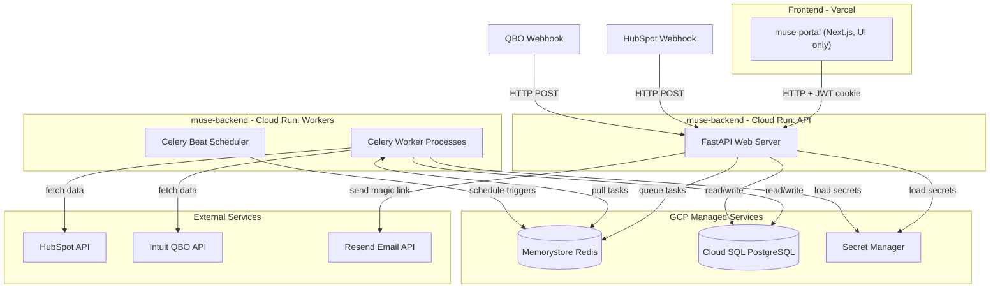
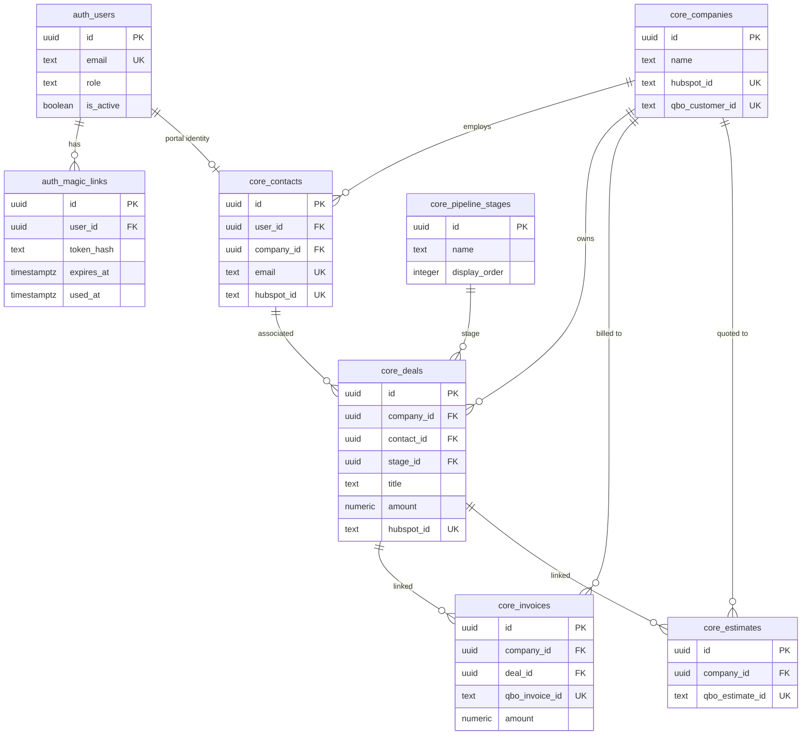
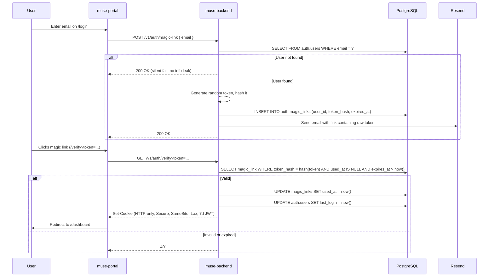

# Architecture: Muse Backend (`muse-backend`)

## 1. Executive Summary

**`muse-backend`** is the centralized Python backend for Muse Semiconductor's internal operations platform. It replaces all server-side logic currently spread across:

- The Next.js Portal's `/api` routes and backend modules (~1,300 lines of auth, HubSpot, QBO, GCP code).
- The legacy `python_applications` cron scripts (40+ scripts for HubSpot, QBO, Box, Dropbox, TSMC, etc.).

After this project is complete:

- **The Next.js Portal (`muse-portal`)** becomes a pure React frontend with zero backend logic. It calls `muse-backend` for everything.
- **The legacy Python scripts (`muse-scripts`)** are gradually migrated into `muse-backend` as Celery tasks.
- **HubSpot** is decommissioned over three phases. All CRM data (users, deals, companies) lives in PostgreSQL.
- **QuickBooks Online** remains as the permanent external accounting system. `muse-backend` owns the OAuth lifecycle and syncs accounting data into PostgreSQL.

---

## 2. Technology Stack

| Layer | Choice | Why |
|---|---|---|
| **Language** | Python 3.12+ | Existing Python codebase (`python_applications`); superior JSON/data manipulation; reuse of `hsapi_token`, `qbo_module`, `box_webhook_listener` |
| **Web Framework** | FastAPI | Async, automatic OpenAPI/Swagger, Pydantic validation, extremely fast |
| **Background Jobs** | Celery + Celery Beat | Replaces GCP Cloud Scheduler + Pub/Sub; native rate limiting, retries with backoff, task chaining, cron scheduling |
| **Message Broker** | Redis (GCP Memorystore) | Required by Celery; replaces the Redis + RQ pattern already used in `box_webhook_listener` |
| **ORM** | SQLAlchemy 2.0 (async) | Multi-schema PostgreSQL support; migration via Alembic |
| **Migrations** | Alembic | Versioned, repeatable schema changes across environments |
| **Data Validation** | Pydantic v2 | Strict typing for webhook payloads, API requests/responses, config |
| **Database** | PostgreSQL 15+ on Cloud SQL | Four schemas: `auth`, `core`, `raw_sync`, `qbo` |
| **Secrets** | GCP Secret Manager (env fallback) | Same resolution pattern as the current Portal (`env -> cache -> Secret Manager`) |
| **Email** | Resend (`resend` Python SDK) | Magic link emails (ported from Portal's `modules/email/`) |
| **Logging** | `structlog` | Structured JSON logs, GCP Cloud Logging compatible |
| **Containerization** | Docker | Single image, multiple entrypoints (API server, Celery worker, Celery beat) |

---

## 3. System Architecture

### 3.1 Component Overview



### 3.2 Data Flow

There are four distinct data flows in the system:

**Flow 1: Portal Request (synchronous)**
Portal sends HTTP request -> FastAPI authenticates JWT -> reads/writes `core` schema -> returns JSON.

**Flow 2: Webhook Ingestion (async, via Celery)**
External source sends webhook -> FastAPI validates HMAC signature -> responds `200` immediately -> queues a Celery task -> Celery worker parses payload -> upserts into `raw_sync` tables -> triggers mapping into `core` tables.

**Flow 3: Hourly Sync (scheduled, via Celery Beat)**
Celery Beat fires on cron schedule -> Celery worker fetches changes from HubSpot/QBO APIs -> upserts into `raw_sync` tables -> triggers mapping into `core` tables.

**Flow 4: Legacy Script Migration (gradual)**
Existing `python_applications` cron scripts -> refactored into Celery tasks -> scheduled via Celery Beat instead of system crontab.

---

## 4. Database Schema Design (PostgreSQL)

**Schemas** in PostgreSQL act like folders or namespaces inside a single database. Instead of putting all tables in the default `public` schema, we organize them into distinct schemas to enforce security boundaries, simplify the HubSpot deprecation, and keep business logic cleanly separated from integration plumbing.

### 4.1 Schema Overview

| Schema | Purpose | Who Reads | Who Writes | Lifetime |
|---|---|---|---|---|
| `auth` | Authentication (users, magic links) | FastAPI (auth endpoints) | FastAPI (auth endpoints) | Permanent |
| `core` | Business domain (deals, customers, invoices, companies) | Portal (via FastAPI), FastAPI | Portal (via FastAPI), mapping workers | Permanent |
| `raw_sync` | Raw JSON from external APIs (HubSpot, QBO) | Mapping workers, debugging | Celery sync/webhook workers | HubSpot tables are temporary; QBO tables are permanent |
| `qbo` | QBO operational data (OAuth tokens) | FastAPI, Celery workers | FastAPI (OAuth flow), Celery (token refresh) | Permanent |

### 4.2 `auth` Schema

Handles passwordless magic-link authentication. Isolated from business data so that a vulnerability in the portal's data layer cannot leak authentication secrets.

#### `auth.users`

| Column | Type | Constraints | Notes |
|---|---|---|---|
| `id` | `UUID` | PK, default `gen_random_uuid()` | Internal user ID |
| `email` | `TEXT` | UNIQUE, NOT NULL | Login identity; initially seeded from HubSpot contacts |
| `display_name` | `TEXT` | | Full name for UI display |
| `role` | `TEXT` | NOT NULL, default `'customer'` | `'admin'` / `'customer'` (replaces `ADMIN_EMAILS` env var) |
| `is_active` | `BOOLEAN` | NOT NULL, default `true` | Soft-disable without deleting |
| `last_login` | `TIMESTAMPTZ` | | |
| `created_at` | `TIMESTAMPTZ` | NOT NULL, default `now()` | |
| `updated_at` | `TIMESTAMPTZ` | NOT NULL, default `now()` | |

**Index:** `(email)` -- unique index handles login lookups.

#### `auth.magic_links`

| Column | Type | Constraints | Notes |
|---|---|---|---|
| `id` | `UUID` | PK, default `gen_random_uuid()` | |
| `user_id` | `UUID` | FK -> `auth.users(id)` ON DELETE CASCADE | |
| `token_hash` | `TEXT` | NOT NULL | SHA-256 of the token emailed via Resend |
| `expires_at` | `TIMESTAMPTZ` | NOT NULL | 15 minutes from creation |
| `used_at` | `TIMESTAMPTZ` | | Nullable. Set on first use; prevents replay attacks |
| `created_at` | `TIMESTAMPTZ` | NOT NULL, default `now()` | |

**Index:** `(token_hash)` -- fast lookup when user clicks the magic link.
**Cleanup:** A scheduled Celery task purges rows older than 24 hours.

### 4.3 `core` Schema

The business domain model. **The Next.js Portal reads and writes exclusively to this schema** (via FastAPI endpoints). It does not know HubSpot or QBO exist.

During Phase 1, data is mapped from `raw_sync` into `core` via Celery mapping tasks. During Phase 3, the portal writes directly to `core`.

#### `core.companies`

| Column | Type | Constraints | Notes |
|---|---|---|---|
| `id` | `UUID` | PK, default `gen_random_uuid()` | Internal ID |
| `name` | `TEXT` | NOT NULL | |
| `domain` | `TEXT` | | Company website domain |
| `hubspot_id` | `TEXT` | UNIQUE, nullable | HubSpot company ID (for mapping during Phase 1/2; nullable after Phase 3) |
| `qbo_customer_id` | `TEXT` | UNIQUE, nullable | QBO Customer ID (permanent link to accounting) |
| `created_at` | `TIMESTAMPTZ` | NOT NULL, default `now()` | |
| `updated_at` | `TIMESTAMPTZ` | NOT NULL, default `now()` | |

#### `core.contacts`

| Column | Type | Constraints | Notes |
|---|---|---|---|
| `id` | `UUID` | PK, default `gen_random_uuid()` | |
| `user_id` | `UUID` | FK -> `auth.users(id)`, nullable | Link to auth identity (set when contact has portal access) |
| `company_id` | `UUID` | FK -> `core.companies(id)`, nullable | |
| `first_name` | `TEXT` | | |
| `last_name` | `TEXT` | | |
| `email` | `TEXT` | UNIQUE, NOT NULL | |
| `phone` | `TEXT` | | |
| `hubspot_id` | `TEXT` | UNIQUE, nullable | Removed after Phase 3 |
| `created_at` | `TIMESTAMPTZ` | NOT NULL, default `now()` | |
| `updated_at` | `TIMESTAMPTZ` | NOT NULL, default `now()` | |

**Index:** `(company_id)` -- list contacts by company.

#### `core.pipeline_stages`

| Column | Type | Constraints | Notes |
|---|---|---|---|
| `id` | `UUID` | PK | |
| `name` | `TEXT` | NOT NULL | e.g. "Qualification", "Proposal", "Closed Won" |
| `display_order` | `INTEGER` | NOT NULL | Sort order in the portal UI |
| `pipeline_name` | `TEXT` | NOT NULL, default `'default'` | Supports multiple pipelines |
| `hubspot_stage_id` | `TEXT` | UNIQUE, nullable | For Phase 1/2 mapping |

#### `core.deals`

| Column | Type | Constraints | Notes |
|---|---|---|---|
| `id` | `UUID` | PK, default `gen_random_uuid()` | |
| `company_id` | `UUID` | FK -> `core.companies(id)` | |
| `contact_id` | `UUID` | FK -> `core.contacts(id)`, nullable | Primary contact on the deal |
| `stage_id` | `UUID` | FK -> `core.pipeline_stages(id)` | |
| `title` | `TEXT` | NOT NULL | Deal name |
| `amount` | `NUMERIC(12,2)` | | Expected revenue |
| `currency` | `TEXT` | default `'USD'` | |
| `close_date` | `DATE` | | |
| `technology` | `TEXT` | | e.g. semiconductor process node |
| `hubspot_id` | `TEXT` | UNIQUE, nullable | Removed after Phase 3 |
| `owner_user_id` | `UUID` | FK -> `auth.users(id)`, nullable | Internal deal owner |
| `properties_json` | `JSONB` | | Overflow for custom/unmapped HubSpot properties |
| `created_at` | `TIMESTAMPTZ` | NOT NULL, default `now()` | |
| `updated_at` | `TIMESTAMPTZ` | NOT NULL, default `now()` | |

**Indexes:**
- `(company_id)` -- portal dashboard groups deals by company
- `(contact_id)` -- deal access check (which contact can see which deals)
- `(stage_id)` -- filter by pipeline stage
- `(hubspot_id)` -- mapping during sync

#### `core.invoices`

| Column | Type | Constraints | Notes |
|---|---|---|---|
| `id` | `UUID` | PK, default `gen_random_uuid()` | |
| `company_id` | `UUID` | FK -> `core.companies(id)` | |
| `deal_id` | `UUID` | FK -> `core.deals(id)`, nullable | Optional link to deal |
| `qbo_invoice_id` | `TEXT` | UNIQUE, NOT NULL | Permanent link to QBO |
| `invoice_number` | `TEXT` | | QBO doc number |
| `amount` | `NUMERIC(12,2)` | | |
| `balance_due` | `NUMERIC(12,2)` | | |
| `currency` | `TEXT` | default `'USD'` | |
| `status` | `TEXT` | | `'draft'` / `'sent'` / `'paid'` / `'overdue'` |
| `due_date` | `DATE` | | |
| `issued_date` | `DATE` | | |
| `line_items_json` | `JSONB` | | Array of line items from QBO |
| `synced_at` | `TIMESTAMPTZ` | | Last time this row was updated from QBO |
| `created_at` | `TIMESTAMPTZ` | NOT NULL, default `now()` | |
| `updated_at` | `TIMESTAMPTZ` | NOT NULL, default `now()` | |

**Indexes:**
- `(company_id)` -- list invoices per company
- `(qbo_invoice_id)` -- unique, for upserts from QBO sync

#### `core.estimates`

| Column | Type | Constraints | Notes |
|---|---|---|---|
| `id` | `UUID` | PK, default `gen_random_uuid()` | |
| `company_id` | `UUID` | FK -> `core.companies(id)` | |
| `deal_id` | `UUID` | FK -> `core.deals(id)`, nullable | |
| `qbo_estimate_id` | `TEXT` | UNIQUE, NOT NULL | |
| `estimate_number` | `TEXT` | | |
| `amount` | `NUMERIC(12,2)` | | |
| `status` | `TEXT` | | |
| `expiry_date` | `DATE` | | |
| `line_items_json` | `JSONB` | | |
| `synced_at` | `TIMESTAMPTZ` | | |
| `created_at` | `TIMESTAMPTZ` | NOT NULL, default `now()` | |
| `updated_at` | `TIMESTAMPTZ` | NOT NULL, default `now()` | |

#### `core.purchase_orders`

| Column | Type | Constraints | Notes |
|---|---|---|---|
| `id` | `UUID` | PK, default `gen_random_uuid()` | |
| `company_id` | `UUID` | FK -> `core.companies(id)` | |
| `deal_id` | `UUID` | FK -> `core.deals(id)`, nullable | |
| `qbo_po_id` | `TEXT` | UNIQUE, NOT NULL | |
| `po_number` | `TEXT` | | |
| `amount` | `NUMERIC(12,2)` | | |
| `status` | `TEXT` | | |
| `vendor_name` | `TEXT` | | |
| `line_items_json` | `JSONB` | | |
| `synced_at` | `TIMESTAMPTZ` | | |
| `created_at` | `TIMESTAMPTZ` | NOT NULL, default `now()` | |
| `updated_at` | `TIMESTAMPTZ` | NOT NULL, default `now()` | |

### 4.4 `raw_sync` Schema

Holds the exact JSON payloads as they arrive from HubSpot and QBO. Acts as an isolated data lake. HubSpot and QBO have **separate tables** so that decommissioning HubSpot is an instant `DROP TABLE` (no expensive `DELETE` + `VACUUM`).

#### `raw_sync.hubspot_sync_runs` / `raw_sync.qbo_sync_runs`

| Column | Type | Notes |
|---|---|---|
| `id` | `UUID` | PK |
| `object_type` | `TEXT` | `'contact'`, `'company'`, `'deal'`, `'association'`, `'invoice'`, etc. |
| `started_at` | `TIMESTAMPTZ` | |
| `finished_at` | `TIMESTAMPTZ` | |
| `status` | `TEXT` | `'running'` / `'completed'` / `'failed'` |
| `error` | `TEXT` | nullable |
| `cursor_bookmark` | `JSONB` | `{ "after": "...", "page": 3 }` for mid-run resume |
| `window_start` | `TIMESTAMPTZ` | |
| `window_end` | `TIMESTAMPTZ` | |
| `records_synced` | `INTEGER` | |

**Index:** `(object_type, status, started_at)` for "last successful run" lookups.

#### `raw_sync.hubspot_webhook_events` / `raw_sync.qbo_webhook_events`

| Column | Type | Notes |
|---|---|---|
| `id` | `TEXT` | PK. Event unique ID from source (idempotency) |
| `received_at` | `TIMESTAMPTZ` | when this service received it |
| `source_updated_at` | `TIMESTAMPTZ` | when the source says the change happened |
| `object_type` | `TEXT` | |
| `source_id` | `TEXT` | |
| `payload_json` | `JSONB` | raw event payload |

**Index:** `(object_type, received_at)` -- debugging and replay.
**Partitioning:** range-partition by `received_at` (monthly) for fast queries and cheap old-partition drops.

#### `raw_sync.hubspot_records` / `raw_sync.qbo_records`

| Column | Type | Notes |
|---|---|---|
| `id` | `UUID` | PK |
| `object_type` | `TEXT` | |
| `source_id` | `TEXT` | |
| `source_updated_at` | `TIMESTAMPTZ` | when the source last changed it |
| `created_at` | `TIMESTAMPTZ` | when this service first saw the record |
| `updated_at` | `TIMESTAMPTZ` | when this service last upserted it |
| `deleted_at` | `TIMESTAMPTZ` | tombstone: marks if the record was deleted in the source |
| `content_hash` | `TEXT` | SHA-256 of `payload_json` for change detection |
| `version` | `BIGINT` | monotonically increasing for incremental polling |
| `payload_json` | `JSONB` | full canonical payload |

**Unique constraint:** `(object_type, source_id)` -- upsert key.
**Indexes:**
- `(object_type, source_updated_at)` -- time-range queries
- `(version)` -- incremental polling
- GIN on `payload_json` -- ad-hoc JSONB queries

**Critical upsert rule:** All upserts must include a chronological guard:
```sql
INSERT INTO raw_sync.hubspot_records (...) VALUES (...)
ON CONFLICT (object_type, source_id)
DO UPDATE SET ...
WHERE raw_sync.hubspot_records.source_updated_at < EXCLUDED.source_updated_at;
```
This prevents out-of-order webhook delivery or sync/webhook race conditions from overwriting newer data with older data.

### 4.5 `qbo` Schema

Operational data specific to the QuickBooks Online integration. Separated because QBO OAuth tokens are highly sensitive and require strict access control.

#### `qbo.oauth_tokens`

| Column | Type | Constraints | Notes |
|---|---|---|---|
| `realm_id` | `TEXT` | PK | QBO company ID (matches `QBO_REALM_ID`) |
| `access_token` | `TEXT` | NOT NULL | Short-lived (60 mins) |
| `refresh_token` | `TEXT` | NOT NULL | Long-lived (100 days), rotates upon use |
| `access_token_expires_at` | `TIMESTAMPTZ` | NOT NULL | |
| `refresh_token_expires_at` | `TIMESTAMPTZ` | NOT NULL | |
| `updated_at` | `TIMESTAMPTZ` | NOT NULL, default `now()` | |

**Note:** Replaces the Firestore `qbo_connections` collection. The FastAPI service and Celery workers both read/write this table. Token refresh uses a Postgres advisory lock to prevent race conditions when multiple processes attempt to refresh simultaneously.

### 4.6 Schema Relationship Diagram



---

## 5. API Surface

### 5.1 Authentication Endpoints (Unauthenticated)

| Method | Path | Description |
|---|---|---|
| `POST` | `/v1/auth/magic-link` | Send magic link email. Body: `{ email }`. Validates user exists in `auth.users`. |
| `GET` | `/v1/auth/verify` | Verify magic link token, set session cookie. Query: `?token=...` |
| `POST` | `/v1/auth/logout` | Clear session cookie. |

### 5.2 Portal Data Endpoints (JWT Required)

| Method | Path | Description |
|---|---|---|
| `GET` | `/v1/deals` | List deals for authenticated contact, grouped by company. Supports filters: `stage`, `company`, `technology`, `date_range`. |
| `GET` | `/v1/deals/{id}` | Deal detail. Enforces contact-deal association access check. |
| `GET` | `/v1/companies` | List companies visible to authenticated contact. |
| `GET` | `/v1/invoices` | List invoices. Filters: `company_id`, `status`, `customer_name`, `muse_part_number`. |
| `GET` | `/v1/invoices/{id}/pdf` | Proxy real-time PDF fetch from QBO. |
| `GET` | `/v1/estimates` | List estimates. Filters: `company_id`, `muse_part_number`. |
| `GET` | `/v1/estimates/{id}/pdf` | Proxy real-time PDF fetch from QBO. |
| `GET` | `/v1/purchase-orders` | List purchase orders. |
| `GET` | `/v1/sync/status` | Last successful sync timestamps per connector and object type. |

### 5.3 Admin Endpoints (JWT Required + Admin Role)

| Method | Path | Description |
|---|---|---|
| `GET` | `/v1/admin/qbo/connect` | Initiate QBO OAuth flow (redirect to Intuit). |
| `GET` | `/v1/admin/qbo/callback` | Handle QBO OAuth callback, store tokens in `qbo.oauth_tokens`. |
| `GET` | `/v1/admin/users` | List all users. |
| `POST` | `/v1/admin/users` | Create / invite a user. |
| `PATCH` | `/v1/admin/users/{id}` | Update user role, active status. |

### 5.4 Webhook Endpoints (HMAC Signature Required)

| Method | Path | Description |
|---|---|---|
| `POST` | `/v1/webhooks/hubspot` | Verify HubSpot HMAC v3 signature, queue Celery task. |
| `POST` | `/v1/webhooks/qbo` | Verify QBO HMAC signature, queue Celery task. |

### 5.5 Infrastructure (Unauthenticated)

| Method | Path | Description |
|---|---|---|
| `GET` | `/v1/health` | Liveness/readiness probe for Cloud Run. |
| `GET` | `/docs` | Auto-generated Swagger UI (FastAPI built-in). |
| `GET` | `/openapi.json` | OpenAPI 3.1 spec (FastAPI built-in). |

---

## 6. Celery Task Design

### 6.1 Celery Beat Schedule (Cron)

| Task | Schedule | Description |
|---|---|---|
| `sync_hubspot_contacts` | Every hour | Fetch changed contacts from HubSpot API |
| `sync_hubspot_companies` | Every hour | Fetch changed companies |
| `sync_hubspot_deals` | Every hour | Fetch changed deals |
| `sync_hubspot_associations` | Every hour (after above) | Fetch contact-deal-company links |
| `sync_qbo_invoices` | Every hour | Fetch changed invoices from QBO API |
| `sync_qbo_estimates` | Every hour | Fetch changed estimates |
| `sync_qbo_purchase_orders` | Every hour | Fetch changed POs |
| `sync_qbo_customers` | Every hour | Fetch changed QBO customers |
| `map_hubspot_to_core` | Every hour (after HS sync) | Map `raw_sync.hubspot_records` -> `core` tables |
| `map_qbo_to_core` | Every hour (after QBO sync) | Map `raw_sync.qbo_records` -> `core` tables |
| `cleanup_expired_magic_links` | Daily at 3 AM | Purge `auth.magic_links` older than 24 hours |

### 6.2 Webhook Processing Tasks (On-Demand)

| Task | Triggered By | Description |
|---|---|---|
| `process_hubspot_webhook` | `POST /v1/webhooks/hubspot` | Parse event, upsert `raw_sync.hubspot_webhook_events` + `raw_sync.hubspot_records`, then map to `core` |
| `process_qbo_webhook` | `POST /v1/webhooks/qbo` | Parse event, upsert `raw_sync.qbo_webhook_events` + `raw_sync.qbo_records`, then map to `core` |

### 6.3 Task Configuration

```python
@app.task(
    bind=True,
    autoretry_for=(Exception,),
    retry_backoff=True,         # exponential backoff
    retry_backoff_max=600,      # max 10 minutes between retries
    max_retries=5,
    rate_limit="10/s",          # HubSpot: ~100 req/10s
)
def sync_hubspot_contacts(self):
    ...
```

### 6.4 Task Chaining (Hourly Sync Pipeline)

The hourly sync uses Celery `chain()` to ensure correct ordering:

```python
from celery import chain, group

hourly_hubspot_sync = chain(
    group(
        sync_hubspot_contacts.s(),
        sync_hubspot_companies.s(),
        sync_hubspot_deals.s(),
    ),
    sync_hubspot_associations.s(),
    map_hubspot_to_core.s(),
)
```

Contacts, companies, and deals sync in parallel (they are independent API calls). Associations sync after all three complete (they reference the synced objects). Mapping to `core` runs last.

---

## 7. Authentication & Security

### 7.1 Magic Link Flow



### 7.2 JWT Session Cookie

- **Algorithm:** HS256 (symmetric, shared `AUTH_SECRET` between Portal and Backend).
- **Payload:** `{ "sub": "<user_id>", "email": "<email>", "role": "<role>", "exp": <7 days> }`.
- **Storage:** HTTP-only, Secure (in production), SameSite=Lax cookie named `muse_session`.
- **Verification:** FastAPI dependency (`get_current_user`) decodes and validates the JWT on every protected request.

### 7.3 Webhook HMAC Verification

- **HubSpot:** v3 signature validation (SHA-256 HMAC of `client_secret + method + URI + body + timestamp`). Fail closed: reject with 403 if invalid.
- **QBO:** Intuit webhook signature verification using `HMAC-SHA256` with the verifier token. Fail closed.
- Both use `fastapi-raw-body` equivalent (or `Request.body()`) to capture the exact raw bytes for hashing.

### 7.4 Role-Based Access

| Role | Portal Access | Admin Endpoints | Deal Visibility |
|---|---|---|---|
| `customer` | Dashboard, own deals, invoices | No | Only deals associated with their contact |
| `admin` | Full dashboard | Yes (user management, QBO connect) | All deals |

### 7.5 Database Access Control

| DB User | `auth` | `core` | `raw_sync` | `qbo` |
|---|---|---|---|---|
| `api_user` (FastAPI) | READ/WRITE | READ/WRITE | READ | READ/WRITE |
| `worker_user` (Celery) | NONE | READ/WRITE | READ/WRITE | READ/WRITE |
| `readonly_user` (debugging) | NONE | READ | READ | NONE |

---

## 8. Project Structure

```
muse-backend/
├── app/
│   ├── __init__.py
│   ├── main.py                              # FastAPI app factory, middleware, route registration
│   ├── core/
│   │   ├── __init__.py
│   │   ├── config.py                        # Pydantic BaseSettings (env + Secret Manager resolution)
│   │   ├── security.py                      # JWT decode/verify, get_current_user dependency
│   │   └── exceptions.py                    # Custom HTTP exceptions
│   ├── db/
│   │   ├── __init__.py
│   │   ├── session.py                       # SQLAlchemy async engine, sessionmaker, get_db dependency
│   │   ├── base.py                          # Declarative base
│   │   └── models/
│   │       ├── __init__.py
│   │       ├── auth.py                      # User, MagicLink
│   │       ├── core.py                      # Company, Contact, Deal, PipelineStage, Invoice, ...
│   │       ├── raw_sync.py                  # HubspotRecord, QboRecord, SyncRun, WebhookEvent
│   │       └── qbo.py                       # OAuthToken
│   ├── api/
│   │   ├── __init__.py
│   │   ├── deps.py                          # Shared dependencies (db session, current user, admin check)
│   │   └── v1/
│   │       ├── __init__.py
│   │       ├── router.py                    # Aggregates all v1 routers
│   │       ├── auth.py                      # /auth/magic-link, /auth/verify, /auth/logout
│   │       ├── deals.py                     # /deals, /deals/{id}
│   │       ├── companies.py                 # /companies
│   │       ├── invoices.py                  # /invoices, /invoices/{id}/pdf
│   │       ├── estimates.py                 # /estimates, /estimates/{id}/pdf
│   │       ├── purchase_orders.py           # /purchase-orders
│   │       ├── sync_status.py               # /sync/status
│   │       ├── admin.py                     # /admin/users, /admin/qbo/connect, /admin/qbo/callback
│   │       ├── webhooks.py                  # /webhooks/hubspot, /webhooks/qbo
│   │       └── health.py                    # /health
│   ├── worker/
│   │   ├── __init__.py
│   │   ├── celery_app.py                    # Celery + Beat initialization, broker config
│   │   ├── tasks_hubspot_sync.py            # Hourly HubSpot sync tasks
│   │   ├── tasks_qbo_sync.py               # Hourly QBO sync tasks
│   │   ├── tasks_hubspot_webhook.py         # HubSpot webhook processing
│   │   ├── tasks_qbo_webhook.py             # QBO webhook processing
│   │   ├── tasks_mapping.py                 # raw_sync -> core mapping logic
│   │   └── tasks_maintenance.py             # Cleanup expired magic links, etc.
│   ├── integrations/
│   │   ├── __init__.py
│   │   ├── hubspot.py                       # HubSpot API client (refactored from hsapi_token.py)
│   │   ├── qbo.py                           # QBO API client (refactored from qbo_module)
│   │   ├── qbo_oauth.py                     # QBO OAuth flow (connect, callback, token refresh)
│   │   ├── resend_email.py                  # Send magic link emails via Resend
│   │   └── gcp_secrets.py                   # getSecret(): env -> cache -> Secret Manager
│   └── services/
│       ├── __init__.py
│       ├── auth_service.py                  # Magic link creation, verification, session management
│       ├── deal_service.py                  # Deal queries, access control, grouping by company
│       ├── invoice_service.py               # Invoice queries, PDF proxy
│       └── mapping_service.py               # raw_sync -> core transformation logic
├── alembic/
│   ├── env.py                               # Alembic environment config
│   ├── versions/
│   │   └── 001_create_schemas_and_tables.py # Initial migration
│   └── script.py.mako
├── alembic.ini
├── tests/
│   ├── conftest.py                          # pytest fixtures (test DB, test client, factory functions)
│   ├── test_auth.py
│   ├── test_deals.py
│   ├── test_webhooks.py
│   ├── test_sync_tasks.py
│   └── test_mapping.py
├── requirements.txt
├── Dockerfile
├── docker-compose.yml                       # Local dev: FastAPI + Celery + Redis + Postgres
├── .env.example
└── README.md
```

---

## 9. Secrets & Configuration

All secrets are resolved via `app/integrations/gcp_secrets.py` using the same pattern as the current Portal: `env var -> in-memory cache -> GCP Secret Manager`.

| Secret | Purpose |
|---|---|
| `DATABASE_URL` | PostgreSQL connection string |
| `REDIS_URL` | Redis connection for Celery broker |
| `AUTH_SECRET` | HS256 JWT signing/verification (must match Portal's `AUTH_SECRET`) |
| `HUBSPOT_ACCESS_TOKEN` | HubSpot private app token (Phase 1/2 only) |
| `HUBSPOT_WEBHOOK_SECRET` | HubSpot HMAC v3 client secret |
| `QBO_CLIENT_ID` | Intuit OAuth client ID |
| `QBO_CLIENT_SECRET` | Intuit OAuth client secret |
| `QBO_WEBHOOK_VERIFIER_TOKEN` | QBO webhook HMAC verifier |
| `QBO_REALM_ID` | Default QBO company ID (single-tenant) |
| `QBO_ENVIRONMENT` | `sandbox` or `production` |
| `RESEND_API_KEY` | Resend email service |
| `FROM_EMAIL` | Sender address for magic links |
| `GOOGLE_CLOUD_PROJECT` | GCP project ID (for Secret Manager) |
| `ADMIN_EMAILS` | Comma-separated list (seed for `auth.users` with `role = 'admin'`; not cached so changes apply without restart) |

Startup validation via Pydantic `BaseSettings`: the application refuses to start if any required secret is missing.

---

## 10. Deployment

### 10.1 Container Strategy

One Docker image, three entrypoints:

| Cloud Run Service | Command | Purpose |
|---|---|---|
| `muse-backend-api` | `uvicorn app.main:app --host 0.0.0.0 --port 8080` | HTTP API server |
| `muse-backend-worker` | `celery -A app.worker.celery_app worker -l info -c 4` | Background task processor |
| `muse-backend-beat` | `celery -A app.worker.celery_app beat -l info` | Cron scheduler (single instance) |

### 10.2 GCP Infrastructure

| Service | Purpose |
|---|---|
| **Cloud Run** (x3) | API, Worker, Beat |
| **Cloud SQL (PostgreSQL 15)** | Database |
| **Cloud SQL Auth Proxy** | Sidecar on all Cloud Run services |
| **Memorystore (Redis)** | Celery message broker |
| **Secret Manager** | All secrets |
| **Artifact Registry** | Docker image storage |

### 10.3 Local Development

```yaml
# docker-compose.yml
services:
  api:
    build: .
    command: uvicorn app.main:app --host 0.0.0.0 --port 8080 --reload
    ports: ["8080:8080"]
    env_file: .env
    depends_on: [postgres, redis]

  worker:
    build: .
    command: celery -A app.worker.celery_app worker -l info
    env_file: .env
    depends_on: [postgres, redis]

  beat:
    build: .
    command: celery -A app.worker.celery_app beat -l info
    env_file: .env
    depends_on: [redis]

  postgres:
    image: postgres:15
    environment:
      POSTGRES_DB: muse
      POSTGRES_USER: muse
      POSTGRES_PASSWORD: muse
    ports: ["5432:5432"]
    volumes: [postgres_data:/var/lib/postgresql/data]

  redis:
    image: redis:7-alpine
    ports: ["6379:6379"]

volumes:
  postgres_data:
```

---

## 11. 3-Phase HubSpot Decommissioning Plan

### Phase 1: Mirroring

- **HubSpot Status:** Source of Truth.
- **Data Flow:** HubSpot -> `raw_sync.hubspot_records` -> mapping worker -> `core` tables (companies, contacts, deals).
- **Portal:** Reads from `core` via `muse-backend` API. Does not write CRM data.
- **Auth:** Magic links validate against `auth.users`, which is seeded from HubSpot contacts during initial migration.
- **QBO:** Syncs into `raw_sync.qbo_records` -> mapping worker -> `core.invoices`, `core.estimates`, etc.

### Phase 2: Co-existence

- **HubSpot Status:** Shared Input.
- **Data Flow:** Some data entered in the Portal (e.g., deal notes, custom fields), some in HubSpot. Both write to `core`.
- **Conflict Resolution:** Field-level authority. Each column in `core.deals` has an explicit owner (HubSpot or Portal). The mapping worker skips columns owned by the Portal. The chronological upsert guard (`source_updated_at`) prevents stale HubSpot data from overwriting newer Portal edits.
- **Portal:** Begins writing to `core` tables via `muse-backend` API (e.g., `PATCH /v1/deals/{id}`).

### Phase 3: Master

- **HubSpot Status:** Decommissioned.
- **Portal:** Full CRUD on `core` tables. Auth validated against `auth.users` (no HubSpot dependency).
- **Cleanup Steps:**
  1. Delete HubSpot webhook subscriptions in the HubSpot developer portal.
  2. Remove `sync_hubspot_*` and `map_hubspot_to_core` Celery tasks from Beat schedule.
  3. Run: `DROP TABLE raw_sync.hubspot_records;`
  4. Run: `DROP TABLE raw_sync.hubspot_webhook_events;`
  5. Run: `DROP TABLE raw_sync.hubspot_sync_runs;`
  6. Remove `hubspot_id` columns from `core` tables (optional migration).
  7. Remove `HUBSPOT_ACCESS_TOKEN` and `HUBSPOT_WEBHOOK_SECRET` from Secret Manager.
  8. Delete `app/integrations/hubspot.py`, `app/worker/tasks_hubspot_*.py`.
- **QBO Continues:** Completely unaffected. `raw_sync.qbo_*` tables and the QBO sync pipeline continue as-is.

---

## 12. Migration Path for Legacy Python Scripts

The existing `python_applications` (now `muse-scripts`) codebase has ~40 operational scripts running on cron. These are migrated gradually into Celery tasks.

### Priority Migration Candidates

| Script | Becomes | Priority |
|---|---|---|
| `hsapi/hsapi_token.py` | `app/integrations/hubspot.py` | Phase 1 (refactor into integration client) |
| `modules/qbo_module/` | `app/integrations/qbo.py` + `qbo_oauth.py` | Phase 1 (refactor into integration client) |
| `box_webhook_listener/` | `app/api/v1/webhooks.py` + `app/worker/tasks_box.py` | Phase 1 (already uses Flask + Redis + RQ) |
| `hs_to_qbo.py` | `app/worker/tasks_mapping.py` | Phase 2 |
| `milestone_emails/` | `app/worker/tasks_notifications.py` | Phase 2 |
| `modules/gmail_module/sendmail.py` | `app/integrations/resend_email.py` (replace Gmail with Resend) | Phase 2 |
| `modules/muse_utility/` | Shared constants move into `app/core/config.py` | Phase 1 |

Scripts that interact with TSMC, FedEx, KLayout, Calibre, etc. remain in `muse-scripts` until there is a clear reason to migrate them.

---

## 13. Observability

- **Structured Logging:** `structlog` with GCP-compatible JSON output (`severity` field). Every log line includes a correlation ID (`x-request-id`).
- **Request Logging:** FastAPI middleware logs method, path, status, duration on every request.
- **Task Logging:** Celery signals (`task_prerun`, `task_postrun`, `task_failure`) log task name, duration, and errors.
- **Custom Metrics** (via Cloud Monitoring or OpenTelemetry):
  - `webhook_events_received` (counter by connector, object_type)
  - `sync_records_upserted` (counter by connector, object_type)
  - `sync_job_duration_seconds` (histogram)
  - `sync_job_failures` (counter)
  - `auth_magic_links_sent` (counter)
  - `auth_logins_successful` (counter)
- **Alerting:** Alert on `sync_job_failures > 0`, Celery queue depth > threshold, API error rate spike, and `qbo.oauth_tokens.refresh_token_expires_at` approaching expiry.

---

## 14. Testing Strategy

| Type | Tool | Scope |
|---|---|---|
| **Unit** | `pytest` | Services, mapping logic, hashing, JWT verification |
| **Integration** | `pytest` + `testcontainers` | SQLAlchemy models against real Postgres; Celery tasks against real Redis |
| **API** | `httpx.AsyncClient` (FastAPI test client) | Full request/response cycle including auth |
| **Webhook Replay** | Custom fixtures | Replay saved HubSpot/QBO webhook payloads and assert `core` state |

---

## 15. Implementation Order

| Step | What | Depends On |
|---|---|---|
| 1 | Scaffold FastAPI + Celery + `docker-compose.yml` | Nothing |
| 2 | Alembic migration: create all four schemas and tables | Step 1 |
| 3 | `gcp_secrets.py` + `config.py` (secret resolution) | Step 1 |
| 4 | Auth endpoints (magic link send/verify, JWT session) | Steps 2, 3 |
| 5 | HubSpot integration client (refactor `hsapi_token.py`) | Step 3 |
| 6 | HubSpot hourly sync Celery tasks + mapping to `core` | Steps 2, 5 |
| 7 | HubSpot webhook endpoint + processing task | Steps 5, 6 |
| 8 | Portal deal endpoints (`/deals`, `/deals/{id}`) | Steps 2, 4 |
| 9 | QBO integration client (refactor `qbo_module`) + OAuth | Step 3 |
| 10 | QBO hourly sync Celery tasks + mapping to `core` | Steps 2, 9 |
| 11 | QBO webhook endpoint + processing task | Steps 9, 10 |
| 12 | Portal invoice/estimate/PO endpoints + PDF proxy | Steps 2, 9 |
| 13 | Strip `muse-portal`: remove all `/api` routes and backend modules | Steps 4, 8, 12 |
| 14 | Deploy to Cloud Run | All above |
